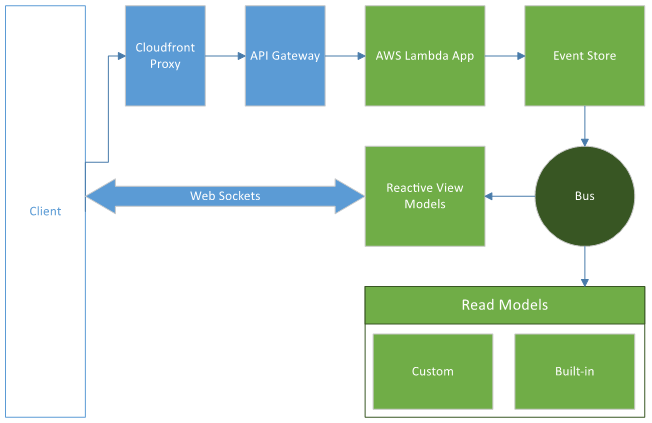

ReSolve Cloud is a serverless cloud platform for your reSolve applications.

To get started with the reSolve cloud platform, register your account at [admin.resolve.sh](admin.resolve.sh). After this, you will gain access to your personal [admin panel](cloud-web-gui.md).

The [resolve-cloud CLI tool](cloud-cli.md) allows you to manage your reSolve cloud applications, and their resources from the terminal.

## Platform Architecture

The reSolve Cloud platform is built on top of Amazon Web Services resources.

The diagram below illustrates the reSolve Cloud platform's general architecture.

A reSolve cloud application has the following essential building blocks:

- AWS Lambda Application - The application's main code deployed to AWS Lambda.
- Event Store - A storage for the application's events.
- Read Models - Serves as the application's read side.
- View Models - Reactive read models that Web Sockets to reactively synchronize their state with the client.
- Bus - A publisher-subscriber (Pub/Sub) layer between the Event Store and Read/View Models.

## Cloud Application Specifics

By default, a reSolve application is configured to store its cloud-specific settings in the **config.cloud.js** file. For information on how to make use of separate configuration files, refer to the [Preparing to Production](preparing-to-production.md) document.

## Limits

The reSolve Cloud Platform allows you to assign no more than 3 SSL certificates to your account. [Contact us](https://github.com/reimagined/resolve#loudspeaker-get-in-touch) if you need to go over this limitation.
