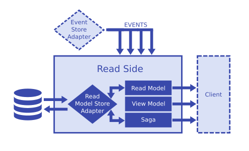

**Read Side**

An application's read side handles eventsand to answers data requests. The read side consists of the following entities:

- Read models - build persistent state based on incomming events and uses this state to build the queried data samples.
- View models - ethemeral read models that use WebSockets to synchronize theis state with the client.
- Sagas - descre long-running processes as chains of events and side effects.

