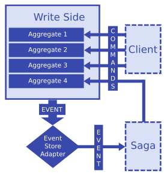

#### Write Side

An application's **write side** handles commands, validates input data, and emits **events** based on valid commands. The framework then saves the emitted events to the **event store**.

