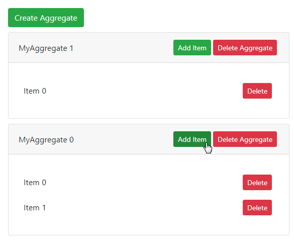

import Chart from './getting-started-chart/\_index.mdx'

## The reSolve Framework

ReSolve is a full stack JavaScript framework based on the Event Sourcing (ES) and Command and Query Responsibility Segregation (CQRS) paradigms designed to meet all the needs of a real-world web application both on the client and server sides.

The interactive chart below illustrates the reSolve framework's architecture. Click nodes within the chart to view more information about the illustrated concepts.

<Chart />

## Create and Explore a reSolve Application

Use the following console input to create a new reSolve application:

```sh
yarn create resolve-app my-app
```

This input create an application based on the [react](https://github.com/reimagined/resolve/tree/dev/templates/js/react) template project. This project contains demo code for the application's read and write sides, as well as a frontend that demonstrates how reSolve works in a basic use-case scenario:



To get familiar with how the application's demo functionality is implemented, view files in the following folders of the created project:

- `common/aggregates` - demonstrates how to handle commands, validate input and produce events from multiple aggregate instances.
- `common/read-models` - demonstrates how to obtain data generated from multiple aggregate instances.
- `common/view-models` - demonstrates how to generate data about the items of a specified aggregate instance.
- `client` - a react application that communicates with the reSolve backend to create aggregate instances and items within them.
- `config.<taget>.js` files - the configuration files for different build targets.
- `run.js` - a script that builds the final config object and starts the application's main loop.

You can use the demo code as a starting point for developing your own application.

## CQRS in reSolve

:::tip Command and Query Responsibility Segregation
In CQRS an application is split into two sides:

- [**Write Side**](#write-side) - receives commands and modifies the application's state based on the command data.
- [**Read Side**](#read-side) - answers data queries based on the application's state.

:::

### Write Side

ReSolve implements the write side as a set of aggregates. An aggregate definition consists of the following parts:

- **Command Handlers** are functions associated with specific types of commands. A command handler implements logic used to analyze the command's data and produce an [event](api/event.md) object that describes a change in the application's state (see [ES in reSolve](#es-in-resolve)).
- **Projection** uses events produced by command handlers to build the aggregate state. This state can then be used by the command handlers, for example to implement input validation.

### Read Side

The read side is implemented as a set of read models. A read model definition consists of the following parts:

- **Projection** receives events and uses their data to modify the read model's persistent store.
- **Resolvers** answer data requests. Resolvers take data from the persistent store and uses it to build the queried data sample.

:::tip View Models
ReSolve also implements a reactive extension of the read model concept called a [view model](read-side.md#view-model-specifics). A view model rebuilds its state on the fly and uses WebSockets to reactively synchronize the state with the client.
:::

## ES in reSolve

:::tip Event Sourcing
In Event Sourcing, an application stores its data as a chain of immutable **events**. From these events, the application builds its current **state** used to answer data requests. The application can rebuild its state from start of the history at any point in time.
:::

The reSolve application stores its data in a centralized event store, which can be configured to use different underlying data storages through the mechanism of adapters.

## What's Next

### Learn ES and CQRS

Refer to the resources listed below to learn more about the ES and CQRS paradigms:

- [Martin Fowler's Enterprise Architecture pattern](https://martinfowler.com/eaaDev/EventSourcing.html)
- [Greg Young classic explanation talk](https://www.youtube.com/watch?v=8JKjvY4etTY)
- [Greg Young's EventStore docs: Event Sourcing Basics](https://eventstore.org/docs/event-sourcing-basics/index.html)
- [Greg Young's DDD CQRS Class](https://www.youtube.com/watch?v=whCk1Q87_ZI)
- [Event Sourcing Made Simple](https://kickstarter.engineering/event-sourcing-made-simple-4a2625113224)
- [Migrating to Microservices and Event-Sourcing: the Dos and Dont’s](https://hackernoon.com/migrating-to-microservices-and-event-sourcing-the-dos-and-donts-195153c7487d)
- [CQRS.nu](http://www.cqrs.nu)
- [Event Sourcing: What it is and why it's awesome](https://barryosull.com/blog/event-sourcing-what-it-is-and-why-it-s-awesome) and other related posts at https://barryosull.com/blog

### The Step-by-Step Tutorial

Throughout the [step-by-step tutorial](tutorial.md), you will iteratively develop a shopping list application and learn fundamental concepts of the reSolve framework in practice as your application's complexity progresses.

### Examples and Templates

Explore the [examples](https://github.com/reimagined/resolve/tree/dev/examples) and [project templates](https://github.com/reimagined/resolve/tree/dev/templates) to familiarize yourself various use-case scenarios supported by reSolve.

### FAQ

The [FAQ](faq.md) article answers popular questions that may arise as you explore reSolve.
