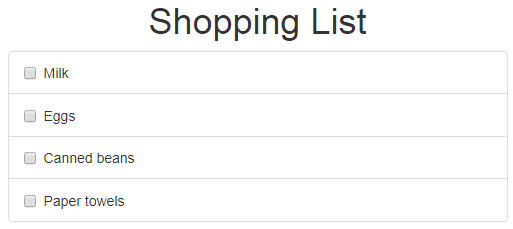
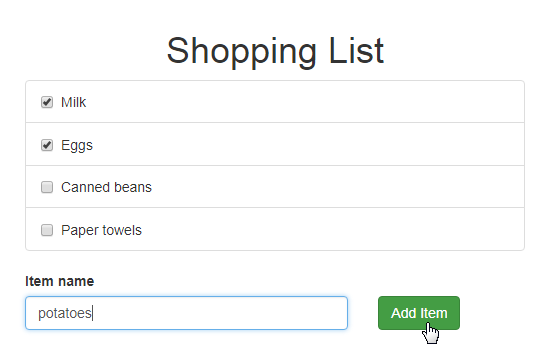

This document provides a step-by-step tutorial for the reSolve framework.
Throughout this tutorial, you will create a single application. You will modify your application as you learn new concepts, so with every consequent lesson the application will become more and more sophisticated.

This tutorial will give you an understanding of the reSolve framework and its fundamental concepts. It is recommended that your familiarize yourself with event sourcing and CQRS before you start this tutorial, however it is not strictly required.

## Table of Contents

- [Lesson 1 - Create a New reSolve Application](#lesson-1-create-a-new-resolve-application)
- [Lesson 2 - Write side - Add a List Item](#lesson-2-write-side-add-a-list-item)
- [Lesson 3 - Read side - Create a View Model to Query List Items](#lesson-3-read-side-create-a-view-model-to-query-list-items)
- [Lesson 4 - Frontend - Display View Model Data in the Browser](#lesson-4-frontend-display-view-model-data-in-the-browser)
- [Lesson 5 - Frontend - Enable Data Editing](#lesson-5-frontend-enable-data-editing)
- [Lesson 6 - Frontend - Support Multiple Shopping Lists](#lesson-6-frontend-support-multiple-shopping-lists)
- [Lesson 7 - Functionality Enhancements](#lesson-7-functionality-enhancements)

---

## **Lesson 1** - Create a New reSolve Application

Use the create-resolve-app tool to create a new reSolve app:

##### npm:

```sh
$ npm i -g create-resolve-app
$ create-resolve-app shopping-list
```

##### npx:

```sh
$ npx create-resolve-app shopping-list
```

##### yarn:

```sh
$ yarn create resolve-app shopping-list
```

After this, a minimal reSolve application is ready. To run it in development mode, type:

```sh
$ cd shopping-list
$ yarn run dev
```

---

## **Lesson 2** - Write side - Add a List Item

[\[Get the Code for This Lesson\]](https://github.com/reimagined/resolve/tree/master/examples/shopping-list-tutorial/lesson-2)

This lesson describes how to implement a basic write side for a reSolve application. An application's [write side](resolve-app-structure.md#write-and-read-sides) handles commands, performs input validation, and emits **events** based on valid commands. The framework then saves the emitted events to the **event store**.

In the CQRS and Event Sourcing paradigms, Domain Objects grouped into aggregates handle commands. ReSolve implements aggregates as static objects that contain sets of functions. These functions can be of one of the following types:

- **[Command Handlers](write-side.md#aggregate-command-handlers)** - Handle commands and emit events in response.
- **[Projections](write-side.md#aggregate-projection-function)** - Build aggregate state from events so this state can be checked on the write side, for example to perform input validation.

### Creating an Aggregate

Use the following steps to implement the write side of your shopping list application:

To add an aggregate to your shopping list application, define types of events that this aggregate can produce. Create an **eventTypes.js** file in the project's **common** folder and add the following content to it:

**common/eventTypes.js:**

```js
export const SHOPPING_LIST_CREATED = 'SHOPPING_LIST_CREATED' // Signals about creation of a shopping list

export const SHOPPING_ITEM_CREATED = 'SHOPPING_ITEM_CREATED' // Signals about creation of an item within a shopping list
```

Next, create a **shopping_list.commands.js** file in the **common/aggregates** folder to store command handlers for the ShoppingList aggregate. Add the following code to the file:

**common/aggregates/shopping_list.commands.js:**

```js
import { SHOPPING_LIST_CREATED, SHOPPING_ITEM_CREATED } from '../eventTypes'

export default {
  createShoppingList: (state, { payload: { name } }) => {
    return {
      type: SHOPPING_LIST_CREATED,
      payload: { name }
    }
  },
  createShoppingItem: (state, { payload: { id, text } }) => {
    return {
      type: SHOPPING_ITEM_CREATED,
      payload: { id, text }
    }
  }
}
```

This file exports an object with two command handlers. A command handler receives the aggregate state and a command payload. A payload can contain any arbitrary data related to the command. For example, the **createShoppingList** command's payload contains the shopping list's name, and the **createShoppingItem** command payload contains an item's ID and display text.

A command handler returns an event object. This object should contain the following fields:

- **type** - specifies the event's type;
- **payload** - specifies data associated with the event.

In the example code, the event payload contains the same fields that were obtained from the command payloads. The reSolve framework saves events that command handlers return to a persistent **[event store](write-side.md#event-store)**. Your application is already configured to use a file-based event store. We suggest that you keep this configuration throughout the tutorial. For information on how to use other storage types see the following documentation topics:

- [Adapters](https://github.com/reimagined/resolve/blob/master/docs/advanced-techniques.md#adapters)
- [Configuring Adapters](https://github.com/reimagined/resolve/blob/master/docs/preparing-to-production.md#configuring-adapters)

Your shopping list aggregate is now ready. The last step is to register it in the application's configuration file. To do this, open the **config.app.js** file and specify the following settings in the **aggregates** configuration section:

**config.app.js:**

```js
...
aggregates: [
  {
    name: 'ShoppingList',
    commands: 'common/aggregates/shopping_list.commands.js',
  }
],
...
```

### Sending Commands to an Aggregate

Now that your application can handle commands, you can use the reSolve framework's standard HTTP API to send such commands to create a shopping list and populate it with items.

A request body should have the `application/json` content type and contain a JSON representation of the command:

```
{
  "aggregateName": "ShoppingList",
  "type": "createShoppingList",
  "aggregateId": "shopping-list-1",
  "payload": {
    "text": "Item 1"
  }
}
```

In addition to the aggregate name, command type and payload, this object specifies the aggregate's ID.

Run your application and send a POST request to the following URL:

```
http://127.0.0.1:3000/api/commands
```

You can use any REST client or **curl** to do this. For example, use the following inputs to create a shopping list:

```sh
$ curl -i http://localhost:3000/api/commands/ \
--header "Content-Type: application/json" \
--data '
{
    "aggregateName": "ShoppingList",
    "aggregateId": "shopping-list-1",
    "type": "createShoppingList",
    "payload": {
        "name": "List 1"
    }
}
'

X-Powered-By: Express
Content-Type: text/plain; charset=utf-8
Date: Wed, 19 Dec 2018 12:16:56 GMT
Connection: keep-alive
Content-Length: 139

{"type":"SHOPPING_LIST_CREATED","payload":{"name":"List 1"},"aggregateId":"shopping-list-1","aggregateVersion":1,"timestamp":1545221816663}

```

Use the inputs shown below to add an item to the created shopping list:

```sh
curl -i http://localhost:3000/api/commands/ \
--header "Content-Type: application/json" \
--data '
{
    "aggregateName": "ShoppingList",
    "aggregateId": "shopping-list-1",
    "type": "createShoppingItem",
    "payload": {
        "id": "1",
        "text": "Milk"
    }
}
'

X-Powered-By: Express
Content-Type: text/plain; charset=utf-8
Date: Wed, 19 Dec 2018 12:17:53 GMT
Connection: keep-alive
Content-Length: 146

{"type":"SHOPPING_ITEM_CREATED","payload":{"id":"1","text":"Milk"},"aggregateId":"shopping-list-1","aggregateVersion":2,"timestamp":1545221873644}

```

You can now check the event store file to see the newly created event. Open the **data/event-store.db** file and locate the created event objects:

<!-- prettier-ignore-start -->

``` json
{"type":"SHOPPING_LIST_CREATED","payload":{"name":"List 1"},"aggregateId":"shopping-list-1","aggregateVersion":1,"timestamp":1542884752421,"aggregateIdAndVersion":"shopping-list-1:1","_id":"Ujiz4pjVwid1AaZP"}
{"type":"SHOPPING_ITEM_CREATED","payload":{"id":"1","text":"Milk"},"aggregateId":"shopping-list-1","aggregateVersion":2,"timestamp":1542884835201,"aggregateIdAndVersion":"shopping-list-1:2","_id":"RBr1596unUVhTJeo"}
{"type":"SHOPPING_ITEM_CREATED","payload":{"id":"2","text":"Eggs"},"aggregateId":"shopping-list-1","aggregateVersion":3,"timestamp":1542884852629,"aggregateIdAndVersion":"shopping-list-1:3","_id":"WJfG65khmyoPY12U"}
{"type":"SHOPPING_ITEM_CREATED","payload":{"id":"3","text":"Canned beans"},"aggregateId":"shopping-list-1","aggregateVersion":4,"timestamp":1542884875144,"aggregateIdAndVersion":"shopping-list-1:4","_id":"qvKCvnEOhVQrD7xJ"}
{"type":"SHOPPING_ITEM_CREATED","payload":{"id":"4","text":"Paper towels"},"aggregateId":"shopping-list-1","aggregateVersion":5,"timestamp":1542884890484,"aggregateIdAndVersion":"shopping-list-1:5","_id":"YEnzkAlBjEqaLwQI"}

```

<!-- prettier-ignore-end -->

### Performing Validation

Your application's write side currently does not perform any input validation. This results in the following issues:

- The command handlers do not check whether all required fields are provided in a command's payload.
- It is possible to create more then one shopping list with the same aggregate ID.
- You can create items in a in a nonexistent shopping list.

You can overcome the first issue by adding simple checks to each command handler:

**common/aggregates/shopping_list.commands.js:**

```js
createShoppingList: (state, { payload: { name } }) => {
  if (!name) throw new Error("name is required");
  ...
},
createShoppingItem: (state, { payload: { id, text } }) => {
  if (!id) throw new Error('id is required')
  if (!text) throw new Error('text is required')
  ...
}
```

To overcome the second and third issues, you can use the **aggregate state**. This state is assembled on the fly by an aggregate **projection** from previously created events. To add a projection to the ShoppingList aggregate, create a **shopping_list.projection.js** file in the **common/aggregates** folder and add the following code there:

**common/aggregates/shopping_list.projection.js:**

<!-- prettier-ignore-start -->

[embedmd]:# (../examples/shopping-list-tutorial/lesson-2/common/aggregates/shopping_list.projection.js /^/ /\n$/)
```js
import { SHOPPING_LIST_CREATED } from "../eventTypes";

export default {
  Init: () => ({}),
  [SHOPPING_LIST_CREATED]: (state, { timestamp }) => ({
    ...state,
    createdAt: timestamp
  })
};
```

<!-- prettier-ignore-end -->

Register the create projection in the application's configuration file:

**config.app.js:**

<!-- prettier-ignore-start -->

[embedmd]:# (../examples/shopping-list-tutorial/lesson-2/config.app.js /^[[:blank:]]+aggregates:/ /\],/)
```js
  aggregates: [
    {
      name: "ShoppingList",
      commands: "common/aggregates/shopping_list.commands.js",
      projection: "common/aggregates/shopping_list.projection.js"
    }
  ],
```

<!-- prettier-ignore-end -->

The projection object specifies an **Init** function and a set of **projection functions**.

- The Init function initializes the aggregate state. In the example code, it creates a new empty object.
- Projection functions build the aggregate state based on the aggregate's events. Each such function is associated with a particular event type. The function receives the previous state and an event, and returns a new state based on the input.

In the example code, the SHOPPING_LIST_CREATED projection function adds the SHOPPING_LIST_CREATED event's timestamp to the state. This information can be used on the write side to find out whether and when a shopping list was created for the current aggregate instance (an instance that the current aggregate ID identifies).

**common/aggregates/shopping_list.commands.js:**

```js
  createShoppingList: (state, { payload: { name } }) => {
    if (state.createdAt) throw new Error("shopping List already exists");
    ...
  },
  createShoppingItem: (state, { payload: { id, text } }) => {
    if (!state || !state.createdAt) {
      throw new Error(`shopping list does not exist`);
    }
    ...
  }
```

You can send commands to your aggregate to check whether the validation works as intended:

```sh
# Trying to create a shopping list without specifying the name
$ curl -i http://localhost:3000/api/commands/ \
> --header "Content-Type: application/json" \
> --data '
> {
>     "aggregateName": "ShoppingList",
>     "aggregateId": "shopping-list-2",
>     "type": "createShoppingList",
>     "payload": { }
> }
> '
  % Total    % Received % Xferd  Average Speed   Time    Time     Time  Current
                                 Dload  Upload   Total   Spent    Left  Speed
100   164  100    31  100   133    142    610 --:--:-- --:--:-- --:--:--   655HTTP/1.1 500 Internal Server Error
X-Powered-By: Express
Date: Thu, 22 Nov 2018 11:14:10 GMT
Connection: keep-alive
Content-Length: 31

Command error: name is required


# When you create a shopping list that already exists
$ curl -i http://localhost:3000/api/commands/ \
> --header "Content-Type: application/json" \
> --data '
> {
>     "aggregateName": "ShoppingList",
>     "aggregateId": "shopping-list-1",
>     "type": "createShoppingList",
>     "payload": {
>         "name": "List 1"
>     }
> }
> '
  % Total    % Received % Xferd  Average Speed   Time    Time     Time  Current
                                 Dload  Upload   Total   Spent    Left  Speed
100   205  100    43  100   162    196    739 --:--:-- --:--:-- --:--:--   798HTTP/1.1 500 Internal Server Error
X-Powered-By: Express
Date: Thu, 22 Nov 2018 11:11:18 GMT
Connection: keep-alive
Content-Length: 43

Command error: the shopping list already exists


# Trying to add an item to an inexistent shopping list
$ curl -i http://localhost:3000/api/commands/ \
> --header "Content-Type: application/json" \
> --data '
> {
>     "aggregateName": "ShoppingList",
>     "aggregateId": "shopping-list-4000",
>     "type": "createShoppingItem",
>     "payload": {
>         "id": "5",
>         "text": "Bread"
>     }
> }
> '
  % Total    % Received % Xferd  Average Speed   Time    Time     Time  Current
                                 Dload  Upload   Total   Spent    Left  Speed
100   226  100    43  100   183    211    901 --:--:-- --:--:-- --:--:--   901HTTP/1.1 500 Internal Server Error
X-Powered-By: Express
Date: Thu, 22 Nov 2018 11:16:56 GMT
Connection: keep-alive
Content-Length: 43

Command error: the shopping list does not exist
```

---

## **Lesson 3** - Read side - Create a View Model to Query List Items

[\[Get the Code for This Lesson\]](https://github.com/reimagined/resolve/tree/master/examples/shopping-list-tutorial/lesson-3)

Currently, your shopping list application has a write side that allows you to create shopping lists and items in these lists. To obtain this data from the application, you need to implement the application's **[read side](resolve-app-structure.md#write-and-read-sides)**.

### Add a View Model

Add a **ShoppingList** **[View Model](read-side.md#view-model-specifics)** to your application. To do this, create a **shopping_list.projection.js** file in the **view-models** folder and add the following code to this file:

**common/view-models/shopping_list.projection.js:**

<!-- prettier-ignore-start -->

[embedmd]:# (../examples/shopping-list-tutorial/lesson-3/common/view-models/shopping_list.projection.js /^/ /\n$/)
```js
import { SHOPPING_LIST_CREATED, SHOPPING_ITEM_CREATED } from "../eventTypes";

export default {
  Init: () => null,
  [SHOPPING_LIST_CREATED]: (state, { aggregateId, payload: { name } }) => ({
    id: aggregateId,
    name,
    list: []
  }),
  [SHOPPING_ITEM_CREATED]: (state, { payload: { id, text } }) => ({
    ...state,
    list: [
      ...state.list,
      {
        id,
        text,
        checked: false
      }
    ]
  })
};
```

<!-- prettier-ignore-end -->

This code defines a View Model **[projection](read-side.md#updating-a-read-model-via-projection-functions)**. A View Model projection runs when the View Model receives a data query. It runs for all events with the specified aggregate IDs and builds a state based on data from these event. The resulting state is then sent back as the query response.

Register the View Model in the application's configuration file as shown below.

**config.app.js:**

```js
...
viewModels: [
  {
    name: 'shoppingList',
    projection: 'common/view-models/shopping_list.projection.js'
  }
],
...
```

### Query a View Model via HTTP API

You can now test the read side's functionality. Send an HTTP request to query the ShoppingList View Model:

```sh
$  curl -i -g -X GET "http://localhost:3000/api/query/shoppingList/shopping-list-1"
HTTP/1.1 200 OK
X-Powered-By: Express
Content-Type: text/html; charset=utf-8
Content-Length: 50
ETag: W/"32-QoPdRfMTxfncCZnYSqRYIDifC/w"
Date: Fri, 16 Nov 2018 12:10:58 GMT
Connection: keep-alive

{
  "id": "shopping-list-1",
  "name": "List 1",
  "list": [
    {
      "id": "1",
      "text": "Milk",
      "checked": false
    },
    {
      "id": "2",
      "text": "Eggs",
      "checked": false
    },
    {
      "id": "3",
      "text": "Canned beans",
      "checked": false
    },
    {
      "id": "4",
      "text": "Paper towels",
      "checked": false
    }
  ]
}
```

The request URL has the following structure:

```
http://{host}:{port}/api/query/{viewModel}/{aggregateIds}
```

##### URL Parameters

| Name         | Description                                                                                               |
| ------------ | --------------------------------------------------------------------------------------------------------- |
| viewModel    | The View Model name as defined in **config.app.js**                                                       |
| aggregateIds | A comma-separated list of Aggregate IDs to include into the View Model. Use `*` to include all Aggregates |

---

## **Lesson 4** - Frontend - Display View Model Data in the Browser

[\[Get the Code for This Lesson\]](https://github.com/reimagined/resolve/tree/master/examples/shopping-list-tutorial/lesson-4)

This lesson provides information on how to display a View Model's data in the client browser. It uses the reSolve framework's **resolve-redux** library to implement a frontend based on React and Redux.

> You can use the [standard HTTP API](curl.md) to communicate with a reSolve backend and use any client technology to implement the frontend.

### Implement a React Frontend

The frontend's source files are located in the **client** folder. Create a **ShoppingList.js** file in the **client/containers** folder. In this file, implement a React component that renders a list of values obtained from the **[data](frontend.md#obtain-view-model-data)** prop:

**client/containers/ShoppingList.js:**

<!-- prettier-ignore-start -->

[embedmd]:# (../examples/shopping-list-tutorial/lesson-4/client/containers/ShoppingList.js /\/\// /^\}/)
```js
// The example code uses components from the react-bootstrap library to reduce the markup.
import { ListGroup, ListGroupItem, Checkbox } from 'react-bootstrap'

export class ShoppingList extends React.PureComponent {
  render() {
    const list = this.props.data.list
    return (
      <ListGroup style={{ maxWidth: '500px', margin: 'auto' }}>
        {list.map(todo => (
          <ListGroupItem key={todo.id}>
            <Checkbox inline>{todo.text}</Checkbox>
          </ListGroupItem>
        ))}
      </ListGroup>
    )
  }
}
```

<!-- prettier-ignore-end -->

Use the **resolve-redux** library's **connectViewModel** HOC to bind your component to the **ShoppingList** View Model that you implemented in the previous lesson.

**client/containers/ShoppingList.js:**

<!-- prettier-ignore-start -->

[embedmd]:# (../examples/shopping-list-tutorial/lesson-4/client/containers/ShoppingList.js /export const mapStateToOptions/ /export default connectViewModel\(mapStateToOptions\)\(ShoppingList\)/)
```js
export const mapStateToOptions = (state, ownProps) => {
  return {
    viewModelName: 'shoppingList',
    aggregateIds: ['shopping-list-1']
  }
}

export default connectViewModel(mapStateToOptions)(ShoppingList)
```

<!-- prettier-ignore-end -->

This HOC binds the original component to a reSolve View Model based on options that the **mapStateToOptions** function specifies. This HOC provides the **data** prop in your component's implementation. This prop provides access to the View Model's response object.

```js
{
  "id": "shopping-list-1",
  "name": "List 1",
  "list": [
    {
      "id": "1",
      "text": "Milk",
      "checked": false
    },
    {
      "id": "2",
      "text": "Eggs",
      "checked": false
    },
    {
      "id": "3",
      "text": "Canned beans",
      "checked": false
    },
    {
      "id": "4",
      "text": "Paper towels",
      "checked": false
    }
  ]
}
```

Insert the implemented **ShoppingList** component into the application's root component:

**client/containers/App.js:**

```js
const App = () => (
  <div>
    ...
    <ShoppingList />
  </div>
)
```

Run your application to view the result:



---

## **Lesson 5** - Frontend - Enable Data Editing

[\[Get the Code for This Lesson\]](https://github.com/reimagined/resolve/tree/master/examples/shopping-list-tutorial/lesson-5)

This lesson describes how to implement a visual interface that allows you to edit shopping list items.

### Modify Backend Functionality

Apply the following modifications to the server code to allow a user to check and uncheck items:

1. Add a new event type that indicates that an item's checkbox was toggled.

**common/eventTypes.js:**

<!-- prettier-ignore-start -->

[embedmd]:# (../examples/shopping-list-tutorial/lesson-5/common/eventTypes.js /export const SHOPPING_ITEM_TOGGLED/ /\n$/)
```js
export const SHOPPING_ITEM_TOGGLED = "SHOPPING_ITEM_TOGGLED";
```

<!-- prettier-ignore-end -->

2. Add a command handler for the **toggleShoppingItem** command.

**common/aggregates/shopping_list.commands.js:**

<!-- prettier-ignore-start -->

[embedmd]:# (../examples/shopping-list-tutorial/lesson-5/common/aggregates/shopping_list.commands.js /^[[:blank:]]+toggleShoppingItem/   /^[[:blank:]]{2}\}/)
```js
  toggleShoppingItem: (state, { payload: { id } }) => {
    if (!state || !state.createdAt) {
      throw new Error(`shopping list does not exist`)
    }
    if (!id) throw new Error('id is required')
    return {
      type: SHOPPING_ITEM_TOGGLED,
      payload: { id }
    }
  }
```

<!-- prettier-ignore-end -->

The event payload contains the toggled item's ID.

3. Modify the **shoppingList** View Model projection to take **SHOPPING_ITEM_TOGGLED** events into account.

**common/view-models/shopping_list.projection.js:**

<!-- prettier-ignore-start -->

[embedmd]:# (../examples/shopping-list-tutorial/lesson-5/common/view-models/shopping_list.projection.js /^[[:space:]]+\[SHOPPING_ITEM_TOGGLED\]/   /^[[:blank:]]+\}\)/)
```js
  [SHOPPING_ITEM_TOGGLED]: (state, { payload: { id } }) => ({
    ...state,
    list: state.list.map(item =>
      item.id === id
        ? {
            ...item,
            checked: !item.checked
          }
        : item
    )
  })
```

<!-- prettier-ignore-end -->

### Access Aggregate Commands on Frontend

A component connected to a reSolve View Model receives an array of aggregate actions (Redux actions that send commands to a reSolve aggregate). Use the following code to generate action creators for these actions:

**client/containers/ShoppingList.js:**

<!-- prettier-ignore-start -->

```js
import { sendAggregateAction } from 'resolve-redux'
import { bindActionCreators } from 'redux'

export const mapDispatchToProps = (dispatch, { aggregateActions }) =>
  bindActionCreators(
    {
      createStory: sendAggregateAction.bind(null, 'Story', 'createStory')
    },
    dispatch
  )

export default connectViewModel(mapStateToOptions)(
  connect(
    null,
    mapDispatchToProps 
  )(ShoppingList)
)
```

<!-- prettier-ignore-end -->

In this code, the component is first connected to a **Redux** state using the **connect** HOC from the **react-redux** library. Next, the component is connected to a reSolve View Model. The **mapDispatchToProps** function takes the reSolve aggregate actions from the component's payload and wraps every action in a **dispatch** call.

### Implement Data Editing UI

#### Item Creation

Use the **createShoppingItem** action creator to add new shopping list items. The UI markup is shown below.

**client/containers/ShoppingList.js:**

<!-- prettier-ignore-start -->

[embedmd]:# (../examples/shopping-list-tutorial/lesson-5/client/containers/ShoppingList.js /^[[:space:]]+\<ControlLabel\>Item name/   /\<\/Row\>/)
```js
        <ControlLabel>Item name</ControlLabel>
        <Row>
          <Col md={8}>
            <FormControl
              className="example-form-control"
              type="text"
              value={this.state.itemText}
              onChange={this.updateItemText}
              onKeyPress={this.onItemTextPressEnter}
            />
          </Col>
          <Col md={4}>
            <Button
              className="example-button"
              bsStyle="success"
              onClick={this.createShoppingItem}
            >
              Add Item
            </Button>
          </Col>
        </Row>
```

<!-- prettier-ignore-end -->

This markup uses the following methods to handle UI interactions:

**client/containers/ShoppingList.js:**

```js
createShoppingItem = () => {
  this.props.createShoppingItem('shopping-list-1', {
    text: this.state.itemText,
    id: Date.now().toString()
  })

  this.setState({
    itemText: ''
  })
}

updateItemText = event => {
  this.setState({
    itemText: event.target.value
  })
}

onItemTextPressEnter = event => {
  if (event.charCode === 13) {
    event.preventDefault()
    this.createShoppingItem()
  }
}
```

#### Item Selection

Use the **toggleShoppingItem** action creator to toggle a shopping list item's checkbox.

**client/containers/ShoppingList.js:**

```js
render() {
  const toggleShoppingItem = this.props.toggleShoppingItem;
  ...
```

<!-- prettier-ignore-start -->

[embedmd]:# (../examples/shopping-list-tutorial/lesson-5/client/containers/ShoppingList.js /^[[:space:]]+\<Checkbox/   /\<\/Checkbox\>/)
```js
              <Checkbox
                inline
                checked={todo.checked}
                onChange={toggleShoppingItem.bind(null, 'shopping-list-1', {
                  id: todo.id
                })}
              >
                {todo.text}
              </Checkbox>
```

<!-- prettier-ignore-end -->

After these steps, your application's UI should look as shown below.



---

## **Lesson 6** - Frontend - Support Multiple Shopping Lists

[\[Get the Code for This Lesson\]](https://github.com/reimagined/resolve/tree/master/examples/shopping-list-tutorial/lesson-6)

Currently, your Shopping List application's UI only allows users to view and edit one shopping list (**shopping-list-1**). This lesson describes how to create multiple shopping lists and navigate between these lists from the client UI.

### Implement a Shopping Lists Read Model

First, modify the application's backend so it can provide information about all available shopping lists. You can implement a View Model to achieve this goal, but this approach is inefficient.

Consider a situation when your application runs in a production environment for a long time and end-users have created a large number of shopping lists. In such situation, a View Model's projection would apply every event from the store to the response object. This would result in a considerable performance overhead _on every request_.

Use a **[Read Model](read-side.md#read-models)** to overcome this limitation. The code sample below demonstrates the ShoppingLists Read Model's projection.

**common/read-models/shopping_lists.projection.js:**

<!-- prettier-ignore-start -->

[embedmd]:# (../examples/shopping-list-tutorial/lesson-6/common/read-models/shopping_lists.projection.js /^/   /\n$/)
```js
import { SHOPPING_LIST_CREATED } from '../eventTypes'

export default {
  Init: async store => {
    await store.defineTable('ShoppingLists', {
      indexes: {
        id: 'string'
      },
      fields: ['createdAt', 'name']
    })
  },

  [SHOPPING_LIST_CREATED]: async (
    store,
    { aggregateId, timestamp, payload: { name } }
  ) => {
    const shoppingList = {
      id: aggregateId,
      name,
      createdAt: timestamp
    }

    await store.insert('ShoppingLists', shoppingList)
  }
}
```

<!-- prettier-ignore-end -->

A Read Model's projection functions apply event data to a persistent store. You also need to implement a **[query resolver](read-side.md#resolvers)** to answer data queries based on the data from the store.

**common/read-models/shopping_lists.resolvers.js:**

<!-- prettier-ignore-start -->

[embedmd]:# (../examples/shopping-list-tutorial/lesson-6/common/read-models/shopping_lists.resolvers.js /^/   /\n$/)
```js
export default {
  all: async store => {
    return await store.find('ShoppingLists', {}, null, { createdAt: 1 })
  }
}
```

<!-- prettier-ignore-end -->

In this example, the **all** resolver returns all available shopping lists.

Next, register the created Read Model in the application's configuration file.

**config.app.js:**

<!-- prettier-ignore-start -->

[embedmd]:# (../examples/shopping-list-tutorial/lesson-6/config.app.js /^[[:blank:]]+readModels:/ /\],/)
```js
  readModels: [
    {
      name: 'ShoppingLists',
      projection: 'common/read-models/shopping_lists.projection.js',
      resolvers: 'common/read-models/shopping_lists.resolvers.js'
    }
  ],
```

<!-- prettier-ignore-end -->

### Query a Read Model Through HTTP API

You can use the standard HTTP API to test the ShoppingLists Read Model's functionality:

```sh
$ curl -X POST \
-H "Content-Type: application/json" \
-d "{}" \
"http://localhost:3000/api/query/ShoppingLists/all"


% Total    % Received % Xferd  Average Speed   Time    Time     Time  Current
                                 Dload  Upload   Total   Spent    Left  Speed
100   186  100   184  100     2    844      9 --:--:-- --:--:-- --:--:--   906[
  {
    "id": "shopping-list-1",
    "name": "List 1",
    "createdAt": 1543325125945
  },
  {
    "id": "shopping-list-2",
    "name": "List 2",
    "createdAt": 1543325129138
  }
]
```

### Implement Client UI

You can now implement the UI to display all available shopping lists and create new shopping lists.

**client/containers/MyLists.js:**

<!-- prettier-ignore-start -->

[embedmd]:# (../examples/shopping-list-tutorial/lesson-6/client/containers/MyLists.js /class MyLists/ /^}/)
```js
class MyLists extends React.PureComponent {
  render() {
    const { lists, createShoppingList } = this.props
    return (
      <div style={{ maxWidth: '500px', margin: 'auto' }}>
        <ShoppingLists lists={lists} />
        <ShoppingListCreator
          lists={lists}
          createShoppingList={createShoppingList}
        />
      </div>
    )
  }
}
```

<!-- prettier-ignore-end -->

> Refer to example project's [ShoppingLists.js](https://github.com/reimagined/resolve/blob/master/examples/shopping-list-tutorial/lesson-6/client/components/ShoppingLists.js) and [ShoppingListsCreator.js](https://github.com/reimagined/resolve/blob/master/examples/shopping-list-tutorial/lesson-6/client/components/ShoppingListCreator.j) files to see how you can implement these components.

Connect the MyLists container component to the ShoppingLists Read Model as shown below.

**client/containers/MyLists.js:**

```js
import { sendAggregateAction } from 'resolve-redux'
import { bindActionCreators } from 'redux'

export const mapStateToOptions = () => ({
  readModelName: 'ShoppingLists',
  resolverName: 'all',
  resolverArgs: {}
})

export const mapStateToProps = (state, ownProps) => ({
  lists: ownProps.data
})

export const mapDispatchToProps = (dispatch) =>
  bindActionCreators(
    {
      createStory: sendAggregateAction.bind(null, 'Story', 'createStory')
    },
    dispatch
  )

export default connectReadModel(mapStateToOptions)(
  connect(
    mapStateToProps,
    mapDispatchToProps 
  )(MyLists)
)
```

Configure the React router to enable navigation between the application pages.

**client/routes.js:**

<!-- prettier-ignore-start -->

[embedmd]:# (../examples/shopping-list-tutorial/lesson-6/client/routes.js /^/ /\n$/)
```js
import App from './containers/App'
import ShoppingList from './containers/ShoppingList'
import MyLists from './containers/MyLists'

export default [
  {
    component: App,
    routes: [
      {
        path: '/',
        component: MyLists,
        exact: true
      },
      {
        path: '/:id',
        component: ShoppingList
      }
    ]
  }
]
```

<!-- prettier-ignore-end -->

Next, modify the **App** component to use the router.

**client/containers/App.js:**

<!-- prettier-ignore-start -->

[embedmd]:# (../examples/shopping-list-tutorial/lesson-6/client/containers/App.js /^/ /\n$/)
```js
import React from 'react'

import Header from './Header.js'
import ShoppingList from './ShoppingList'

const App = ({
  children,
  match: {
    params: { id }
  }
}) => (
  <div>
    <Header
      title="reSolve Shopping List"
      name="Shopping List"
      favicon="/favicon.ico"
      css={['/bootstrap.min.css']}
    />
    {children}
  </div>
)

export default App
```

<!-- prettier-ignore-end -->

Additionally, modify the **ShoppingList** component so it obtains the selected shopping list's aggregate ID from the **:id** route parameter.

**client/containers/ShoppingList.js:**

```jsx
export const mapStateToOptions = (state, ownProps) => {
  const aggregateId = ownProps.match.params.id

  return {
    viewModelName: 'shoppingList',
    aggregateIds: [aggregateId]
  }
}

export const mapStateToProps = (state, ownProps) => {
  const aggregateId = ownProps.match.params.id

  return {
    aggregateId
  }
}
```

Run the application and try to create a new shopping list. You will notice that the frontend correctly sends commands to the server, but the created shopping list only appears after you refresh the page. This is an expected behavior because, in contrast to View Models, Read Models are not reactive. This means that components connected to Read Models do not automatically synchronize their Redux state with the Read Model's state on the server.

To overcome this limitation, implement optimistic UI updates as the next section describes.

### Support Optimistic UI Updates

With this approach, a component applies model changes to the Redux state before it sends these changes to the server. Follow the steps below to provide such functionality.

First, define Redux actions that perform state updates.

**client/actions/optimistic_actions.js:**

<!-- prettier-ignore-start -->

[embedmd]:# (../examples/shopping-list-tutorial/lesson-6/client/actions/optimistic_actions.js /^/ /\n$/)
```js
export const OPTIMISTIC_CREATE_SHOPPING_LIST = 'OPTIMISTIC_CREATE_SHOPPING_LIST'
export const OPTIMISTIC_SYNC = 'OPTIMISTIC_SYNC'
```

<!-- prettier-ignore-end -->

Implement an optimistic reducer function that handles these actions to update the corresponding slice of the Redux state.

**client/reducers/optimistic_shopping_lists.js:**

<!-- prettier-ignore-start -->

[embedmd]:# (../examples/shopping-list-tutorial/lesson-6/client/reducers/optimistic_shopping_lists.js /^/ /\n$/)
```js
import { LOCATION_CHANGE } from 'react-router-redux'
import {
  OPTIMISTIC_CREATE_SHOPPING_LIST,
  OPTIMISTIC_SYNC
} from '../actions/optimistic_actions'

const optimistic_shopping_lists = (state = [], action) => {
  switch (action.type) {
    case LOCATION_CHANGE: {
      return []
    }
    case OPTIMISTIC_CREATE_SHOPPING_LIST: {
      return [
        ...state,
        {
          id: action.payload.id,
          name: action.payload.name
        }
      ]
    }
    case OPTIMISTIC_SYNC: {
      return action.payload.originalLists
    }
    default: {
      return state
    }
  }
}

export default optimistic_shopping_lists
```

<!-- prettier-ignore-end -->

Provide a saga that intercepts the service actions used for communication between Redux and reSolve.

**client/sagas/optimistic_shopping_lists_saga.js:**

<!-- prettier-ignore-start -->

[embedmd]:# (../examples/shopping-list-tutorial/lesson-6/client/sagas/optimistic_shopping_lists_saga.js /^/ /\n$/)
```js
import { takeEvery, put } from 'redux-saga/effects'
import { actionTypes } from 'resolve-redux'

import {
  OPTIMISTIC_CREATE_SHOPPING_LIST,
  OPTIMISTIC_SYNC
} from '../actions/optimistic_actions'

const { SEND_COMMAND_SUCCESS, LOAD_READMODEL_STATE_SUCCESS } = actionTypes

export default function* () {
  yield takeEvery(
    action =>
      action.type === SEND_COMMAND_SUCCESS &&
      action.commandType === 'createShoppingList',
    function* (action) {
      yield put({
        type: OPTIMISTIC_CREATE_SHOPPING_LIST,
        payload: {
          id: action.aggregateId,
          name: action.payload.name
        }
      })
    }
  )

  yield takeEvery(
    action =>
      action.type === LOAD_READMODEL_STATE_SUCCESS,
    function* (action) {
      yield put({
        type: OPTIMISTIC_SYNC,
        payload: {
          originalLists: action.result
        }
      })
    }
  )
}
```

<!-- prettier-ignore-end -->

Modify the MyLists component's **mapStateToProps** function to obtain the component's props from the corresponding slice of the Redux state:

```jsx
export const mapStateToProps = (state, ownProps) => ({
  lists: state.optimisticShoppingLists || []
})
```

Run your application and create a new shopping list to view the result.

---

## **Lesson 7** - Functionality Enhancements

[\[Get the Code for This Lesson\]](https://github.com/reimagined/resolve/tree/master/examples/shopping-list-tutorial/lesson-7)

The lesson describes how to expand the Shopping List application's functionality:

- Modify the reSolve backend to provide the complete set of CRUD (create, read, update, delete) operations.
- Modify the frontend to support all CRUD operations.
- Add static resources to the frontend.

### Modify the Backend

#### Update the Write Side

Define the following events to implement the full set of CRUD (create, read, update, delete) operations:

**common/event_types.js:**

```js
...
export const SHOPPING_LIST_CREATED = 'SHOPPING_LIST_CREATED'
export const SHOPPING_LIST_RENAMED = 'SHOPPING_LIST_RENAMED'
export const SHOPPING_LIST_REMOVED = 'SHOPPING_LIST_REMOVED'
export const SHOPPING_ITEM_REMOVED = 'SHOPPING_ITEM_REMOVED'
```

Modify the aggregate projection to allow you to delete a shopping list.

**common/aggregates/shopping_list.projection.js:**

```js
[SHOPPING_LIST_REMOVED]: () => ({})
```

Define command handlers used to edit data.

**common/aggregates/shopping_list.commands.js:**

```js
...

  renameShoppingList: (state, { payload: { name } }) => {
    return {
      type: SHOPPING_LIST_RENAMED,
      payload: { name }
    }
  },

  removeShoppingList: state => {
    return {
      type: SHOPPING_LIST_REMOVED
    }
  },

  removeShoppingItem: (state, { payload: { id } }) => {
    return {
      type: SHOPPING_ITEM_REMOVED,
      payload: { id }
    }
  }
```

#### Update the Read Side

Modify the ShoppingList View Model projection to handle the new event types.

**common/view-models/shopping_list.projection.js:**

```js
...

  [SHOPPING_LIST_RENAMED]: (state, { payload: { name } }) => ({
    ...state,
    name
  }),

  [SHOPPING_LIST_REMOVED]: () => ({
    removed: true
  }),

  [SHOPPING_ITEM_REMOVED]: (state, { payload: { id } }) => ({
    ...state,
    list: state.list.filter(item => item.id !== id)
  })
```

Modify the ShoppingLists Read Model projection.

**common/read-models/shopping_lists.projection.js:**

```js
...

  [SHOPPING_LIST_REMOVED]: async (store, { aggregateId }) => {
    await store.delete('ShoppingLists', { id: aggregateId })
  },

  [SHOPPING_LIST_RENAMED]: async (
    store,
    { aggregateId, payload: { name } }
  ) => {
    await store.update('ShoppingLists', { id: aggregateId }, { $set: { name } })
  }
```

### Modify the Frontend

#### Use Static Content

Add the static content to the application's **static** folder. The example application uses the following static files:

- The **Styles.css** file - Contains styles the application's client components use.
- The **fontawesome.min.css** file an the **webfonts** folder - The standard [Font Awesome](https://fontawesome.com/) distribution.
- The **close-button.png** image - The Remove Shopping List button's icon.

#### Update Components

Modify the ShoppingLists component to provide a UI for shopping list deletion.

**client/components/ShoppingLists.js:**

```js
<th className="example-table-action">Action</th>
...

<td className="example-table-action">
  <Button
    onClick={() => {
      this.props.removeShoppingList(id)
    }}
  >
    <i className="far fa-trash-alt" />
  </Button>
</td>

```

```js
const { lists, createShoppingList, removeShoppingList } = this.props
...
<ShoppingLists lists={lists} removeShoppingList={removeShoppingList} />
```

Modify the ShoppingList component to allow users to rename shopping lists.

**client/containers/ShoppingList.js:**

```js
state = {
  shoppingListName: this.props.data && this.props.data.name
  ...
}

renameShoppingList = () => {
  this.props.renameShoppingList(this.props.aggregateId, {
    name: this.state.shoppingListName
  })
}

onShoppingListNamePressEnter = event => {
  if (event.charCode === 13) {
    event.preventDefault()
    this.renameShoppingList()
  }
}

updateShoppingListName = event => {
  this.setState({
    shoppingListName: event.target.value
  })
}
...

<FormControl
  type="text"
  value={this.state.shoppingListName}
  onChange={this.updateShoppingListName}
  onKeyPress={this.onShoppingListNamePressEnter}
  onBlur={this.renameShoppingList}
/>
```

Add the list item deletion functionality.

**client/containers/ShoppingList.js:**

```js
const {
  ...
  removeShoppingItem
} = this.props

<Image
  className="example-close-button"
  src="/close-button.png"
  onClick={removeShoppingItem.bind(null, aggregateId, {
    id: todo.id
  })}
/>
```

The code below implements the **Image** component.

**client/containers/Image.js:**

```js
import { Image as BootstrapImage } from 'react-bootstrap'
import { connectStaticBasedUrls } from 'resolve-redux'

const Image = connectStaticBasedUrls(['src'])(BootstrapImage)

export default Image
```

#### Link Stylesheets:

Use the React Helmet component to link stylesheets to your application.

**client/containers/Header.js:**

```js
import {Helmet} from "react-helmet"
...

<Helmet>
  {css.map((href, index) => (
    <link rel="stylesheet" href={href} key={index} />
  ))}
  ...
</Helmet>
...
export default connectStaticBasedUrls(['css', 'favicon'])(Header)
```

**client/containers/App.js:**

```js
<Header
  css={['/fontawesome.min.css', '/style.css', ...]}
  ...
/>
```

#### Update the Optimistic Updates Code

Modify the code related to optimistic UI updates to support the shopping list deletion.

**client/actions/optimistic_actions.js:**

```js
...
export const OPTIMISTIC_REMOVE_SHOPPING_LIST = 'OPTIMISTIC_REMOVE_SHOPPING_LIST'
```

**client/reducers/optimistic_shopping_lists.js:**

```js
import { LOCATION_CHANGE } from 'react-router-redux'
...

  switch (action.type) {
    case LOCATION_CHANGE: {
      return []
    }
    case OPTIMISTIC_REMOVE_SHOPPING_LIST: {
      return state.filter(item => {
        return item.id !== action.payload.id
      })
    }
    ...
  }
```

**client/sagas/optimistic_shopping_lists_saga.js:**

```js
import { takeEvery, put } from 'redux-saga/effects'
import { actionTypes } from 'resolve-redux'

import {
  OPTIMISTIC_CREATE_SHOPPING_LIST,
  OPTIMISTIC_REMOVE_SHOPPING_LIST,
  OPTIMISTIC_SYNC
} from '../actions/optimistic_actions'

const { SEND_COMMAND_SUCCESS, LOAD_READMODEL_STATE_SUCCESS } = actionTypes

export default function* () {
  yield takeEvery(
    action =>
      action.type === SEND_COMMAND_SUCCESS &&
      action.commandType === 'createShoppingList',
    function* (action) {
      yield put({
        type: OPTIMISTIC_CREATE_SHOPPING_LIST,
        payload: {
          id: action.aggregateId,
          name: action.payload.name
        }
      })
    }
  )

  yield takeEvery(
    action =>
      action.type === SEND_COMMAND_SUCCESS &&
      action.commandType === 'removeShoppingList',
    function* (action) {
      yield put({
        type: OPTIMISTIC_REMOVE_SHOPPING_LIST,
        payload: {
          id: action.aggregateId
        }
      })
    }
  )

  yield takeEvery(
    action =>
      action.type === LOAD_READMODEL_STATE_SUCCESS,
    function* (action) {
      yield put({
        type: OPTIMISTIC_SYNC,
        payload: {
          originalLists: action.result
        }
      })
    }
  )
}
```
