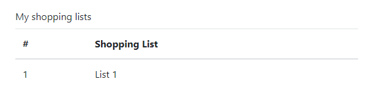
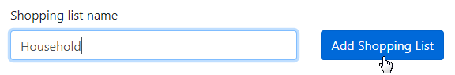
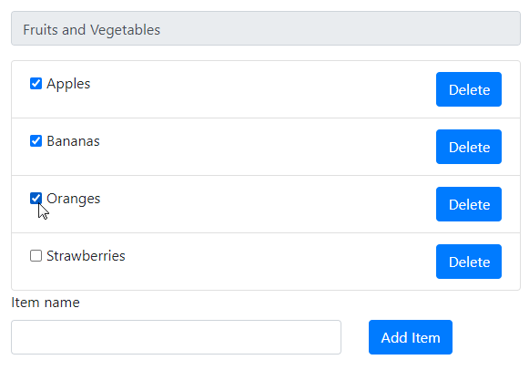

```mdx-code-block
import Tabs from '@theme/Tabs';
import TabItem from '@theme/TabItem';
```

This document provides a step-by-step tutorial for the reSolve framework.
Throughout this tutorial, you will iteratively develop a ShoppingList application and learn fundamental concepts of the reSolve framework.

:::tip ES, CQRS
The reSolve framework implements the Event Sourcing (ES) and Command and Query Responsibility Segregation (CQRS) paradigms.

- With **ES**, your application stores not a mutable state, but a chain of events that lead to this state. With this approach, no information is ever lost by the application and the state can always be rebuilt from the beginning of the history.

- The **CQRS** paradigm requires an application to implement the write side that can only handle commands, and the read side that answers data requests.

We recommend that your familiarize yourself with basics of event sourcing and CQRS before you start this tutorial. You can find a curated list of learning resources in the [FAQ](faq.md).
:::

## Table of Contents

- [Preparation - Create a New reSolve Application](#preparation---create-a-new-resolve-application)
- [Lesson 1 - Write side - Add Shopping Lists](#lesson-1---write-side---add-shopping-lists)
- [Lesson 2 - Read side - Create a Read Model to Query Shopping Lists](#lesson-2---read-side---create-a-read-model-to-query-shopping-lists)
- [Lesson 3 - Frontend - Display Read Model Data in the Browser](#lesson-3---frontend---display-read-model-data-in-the-browser)
- [Lesson 4 - Read Side - Create a View Model to Query Shopping List Items](#lesson-4---read-side---create-a-view-model-to-query-shopping-list-items)
- [Lesson 5 - Enable Editing](#lesson-5---enable-editing)

---

## **Preparation** - Create a New reSolve Application

Use the **create-resolve-app** tool to create a new reSolve application:

```sh
yarn create resolve-app shopping-list
```

After this, a minimal reSolve application is ready. To run it in development mode, type:

```sh
cd shopping-list
yarn dev
```

### Running Tests

A new reSolve application contains a minimalistic [TestCafe](https://testcafe.io/) test located in `test/e2e/index.test.js` that runs on the client and checks that the reSolve server responds normally. You are also free to modify this file to check your application's functionality.

Call the project's `test:e2e` script to run the test:

```sh
yarn test:e2e
```

Each consequent lesson in this tutorial will offer you new tests as you develop your application. Copy these tests to your application and run them to ensure that you are ready to move to the next lesson.

### Remove Demo Code

A new application contains demo code that demonstrates reSolve's core features. Follow the steps below to remove this code so you can start your application from scratch:

- Delete all the contents from the project's **client** and **common** folders.
- Open the **config.app.js** file and remove all options specified within the `appConfig` configuration object:
  ```js
  // config.app.js
  const appConfig = {
    // This object should be empty.
  }
  export default appConfig
  ```
- Open the **config.dev.js** and **config.test-functional.js** files and, in both files, remove or comment out the `readModelConnectors` option:

  ```js
  // config.dev.js, config.test-functional.js
  const devConfig = {
  ...
    // Remove or comment out the option below.

    // readModelConnectors: {
    //   default: {
    //     module: '@resolve-js/readmodel-lite',
    //     options: {
    //       databaseFile: 'data/read-models.db',
    //     },
    //   },
    // }
    ...
  }
  export default devConfig
  ```

- Open the **test/e2e/index.test.js** file and remove or comment out the following test case:

  ```js
  // Remove or comment out the test case below.

  // test('home page', async (t) => {
  // await t
  //    .expect(await Selector('span').withText('reSolve React Template').exists)
  //    .eql(true)
  // })
  ```

## **Lesson 1** - Write side - Add Shopping Lists

[\[Get the Code for This Lesson\]](https://github.com/reimagined/resolve/tree/master/tutorial/lesson-1)

This lesson describes how to implement a write side for a reSolve application. An application's [write side](resolve-app-structure.md#write-and-read-sides) handles commands, validates input data, and emits **events** based on valid commands. The framework then saves the emitted events to the **event store**.

### Create an Aggregate

Define types of events that the write side can produce. Create an **eventTypes.js** file in the project's **common** folder and add the following content to it:

**common/eventTypes.js**

```js
export const SHOPPING_LIST_CREATED = 'SHOPPING_LIST_CREATED' // Indicates the creation of a shopping list.
export const SHOPPING_ITEM_CREATED = 'SHOPPING_ITEM_CREATED' // Indicates the creation of an item within a shopping list.
```

Next, define an aggregate that handles commands and produces the defined events as a result.

:::tip Aggregate

In terms of the event sourcing paradigm, an aggregate is a cluster of domain objects. An aggregate should be able to handle its commands without the need to communicate with other aggregates, which also makes it a transaction boundary.

:::

Create a **shopping_list.commands.js** file in the **common/aggregates** folder and add the following code to it:

**common/aggregates/shopping_list.commands.js**

```js
import { SHOPPING_LIST_CREATED, SHOPPING_ITEM_CREATED } from '../eventTypes'

// This file exports an object that contains two command handlers.
export default {
  // A command handler receives the aggregate state and a command payload.
  // A payload can contain arbitrary data related to the command.
  // For example, the "createShoppingList" command's payload contains the shopping list's name.
  createShoppingList: (state, { payload: { name } }) => {
    return {
      type: SHOPPING_LIST_CREATED,
      payload: { name },
    }
  },
  // The "createShoppingItem" command's payload contains an item's ID and display text.
  createShoppingItem: (state, { payload: { id, text } }) => {
    return {
      type: SHOPPING_ITEM_CREATED,
      payload: { id, text },
    }
  },
}
```

A command handler returns an **event** object. This object should contain the following fields:

- **type** - specifies the event's type;
- **payload** - specifies data associated with the event.

The reSolve framework saves produced events to a persistent **[event store](write-side.md#event-store)**. A newly created application is configured to use a SQLite event store. We suggest that you keep this configuration throughout the tutorial. For information on how to use other storage types, see the following documentation topics:

- [Adapters](https://github.com/reimagined/resolve/blob/master/docs/advanced-techniques.md#adapters)
- [Configuring Adapters](https://github.com/reimagined/resolve/blob/master/docs/preparing-to-production.md#configuring-adapters)

The last step is to register the implemented aggregate in the application's configuration file. To do this, open the **config.app.js** file and specify the following settings in the **aggregates** configuration section:

**config.app.js**

```js
const appConfig = {
  aggregates: [
    {
      // The aggregate name
      name: 'ShoppingList',
      // A path to the file that defines the aggregate's command handlers
      commands: 'common/aggregates/shopping_list.commands.js',
    },
  ],
}
export default appConfig
```

### Sending Commands to an Aggregate

Now that your application can handle commands, you can use the reSolve framework's HTTP API to create shopping lists and populate them with items.

A request's body should have the `application/json` content type and contain a JSON representation of a command:

```
{
  "aggregateName": "ShoppingList",
  "type": "createShoppingList",
  "aggregateId": "shopping-list-1",
  "payload": {
    "name": "Item 1"
  }
}
```

In addition to the aggregate name, command type and payload, this object specifies the aggregate's ID.

To send a command to the aggregate, run the application and send a POST request to the following URL:

```
http://127.0.0.1:3000/api/commands
```

<details>
<summary>

**Test Your Application**

Expand this section for an example, on how to test this functionality in your application.

</summary>

You can write an end-to-end test to check the new functionality. Refer to the [Running Tests](#running-tests) section for the information on how to run tests in your application.

You can manually modify your application's test as shown below or use the test included into the lesson's [example project](https://github.com/reimagined/resolve/tree/dev/tutorial/lesson-1):

[test/e2e/index.test.js:](https://github.com/reimagined/resolve/blob/dev/tutorial/lesson-1/test/e2e/index.test.js)

```js
import { Selector, t } from 'testcafe'
import fetch from 'isomorphic-fetch'

const host = process.env.HOST || 'localhost'
const MAIN_PAGE = `http://${host}:3000`
// eslint-disable-next-line no-unused-expressions, no-undef
fixture`reSolve Application`.beforeEach(async (t) => {
  await t.setNativeDialogHandler(() => true)
  // Your app does not currently have a frontend, so comment out the line below.
  // await t.navigateTo(MAIN_PAGE)
})

test('createShoppingList', async () => {
  const command = {
    aggregateName: 'ShoppingList',
    aggregateId: 'shopping-list-1',
    type: 'createShoppingList',
    payload: {
      name: 'List 1',
    },
  }

  const response = await fetch(`${MAIN_PAGE}/api/commands`, {
    headers: {
      'Content-Type': 'application/json',
    },
    method: 'POST',
    body: JSON.stringify(command),
  })

  const event = await response.json()

  await t
    .expect(event)
    .contains({
      type: 'SHOPPING_LIST_CREATED',
      aggregateId: 'shopping-list-1',
      aggregateVersion: 1,
    })
    .expect(event.payload)
    .contains({
      name: 'List 1',
    })
})

test('createShoppingItem', async () => {
  const command = {
    aggregateName: 'ShoppingList',
    aggregateId: 'shopping-list-1',
    type: 'createShoppingItem',
    payload: {
      id: '1',
      text: 'Milk',
    },
  }

  const response = await fetch(`${MAIN_PAGE}/api/commands`, {
    headers: {
      'Content-Type': 'application/json',
    },
    method: 'POST',
    body: JSON.stringify(command),
  })

  const event = await response.json()

  await t
    .expect(event)
    .contains({
      type: 'SHOPPING_ITEM_CREATED',
      aggregateId: 'shopping-list-1',
      aggregateVersion: 2,
    })
    .expect(event.payload)
    .contains({ id: '1', text: 'Milk' })
})

test('createShoppingItems', async () => {
  const matches = [
    {
      command: {
        aggregateName: 'ShoppingList',
        aggregateId: 'shopping-list-1',
        type: 'createShoppingItem',
        payload: {
          id: '2',
          text: 'Eggs',
        },
      },
      event: {
        type: 'SHOPPING_ITEM_CREATED',
        payload: { id: '2', text: 'Eggs' },
        aggregateId: 'shopping-list-1',
        aggregateVersion: 3,
      },
    },
    {
      command: {
        aggregateName: 'ShoppingList',
        aggregateId: 'shopping-list-1',
        type: 'createShoppingItem',
        payload: {
          id: '3',
          text: 'Canned beans',
        },
      },
      event: {
        type: 'SHOPPING_ITEM_CREATED',
        payload: { id: '3', text: 'Canned beans' },
        aggregateId: 'shopping-list-1',
        aggregateVersion: 4,
      },
    },
    {
      command: {
        aggregateName: 'ShoppingList',
        aggregateId: 'shopping-list-1',
        type: 'createShoppingItem',
        payload: {
          id: '4',
          text: 'Paper towels',
        },
      },
      event: {
        type: 'SHOPPING_ITEM_CREATED',
        payload: { id: '4', text: 'Paper towels' },
        aggregateId: 'shopping-list-1',
        aggregateVersion: 5,
      },
    },
  ]

  for (const match of matches) {
    const response = await fetch(`${MAIN_PAGE}/api/commands`, {
      headers: {
        'Content-Type': 'application/json',
      },
      method: 'POST',
      body: JSON.stringify(match.command),
    })

    const event = await response.json()

    await t
      .expect(event)
      .contains({
        aggregateId: match.event.aggregateId,
        aggregateVersion: match.event.aggregateVersion,
        type: match.event.type,
      })
      .expect(event.payload)
      .contains(match.event.payload)
  }
})
```

Call the project's `test:e2e` script to run the test:

```sh
yarn test:e2e
```

</details>

### Input Validation

Your application's write side currently does not validate input data. This results in the following issues:

- The command handlers do not check whether all required fields are in a command's payload.
- It is possible to create more then one shopping list with the same aggregate ID.
- You can create items in a nonexistent shopping list.

To overcome the first issue, add checks at the beginning of each command handler:

**common/aggregates/shopping_list.commands.js**

```js
createShoppingList: (state, { payload: { name } }) => {
  if (!name) throw new Error('The "name" field is required');
  ...
},
createShoppingItem: (state, { payload: { id, text } }) => {
  if (!id) throw new Error('The "id" field is required')
  if (!text) throw new Error('The "text" field is required')
  ...
}
```

To overcome the second and third issues, you need to have an **aggregate state** object that keeps track of what shopping lists were already created. An aggregate **projection** assembles such an object from previously created events with the same aggregate ID. To add a projection to the ShoppingList aggregate, create a **shopping_list.projection.js** file in the **common/aggregates** folder and add the following code to this file:

**common/aggregates/shopping_list.projection.js**

```js
import { SHOPPING_LIST_CREATED } from '../eventTypes'

export default {
  // The Init function initializes a state object
  Init: () => ({}),
  // A projection function updates the state based on events.
  // Each function is associated with a single event type.
  // A projection function receives the state and an event, and returns the updated state.
  [SHOPPING_LIST_CREATED]: (state, { timestamp }) => ({
    ...state,
    createdAt: timestamp, // Add an event's timestamp to the state.
  }),
}
```

Register the projection in the application's configuration file:

**config.app.js**

```js
aggregates: [
  {
    name: "ShoppingList",
    commands: "common/aggregates/shopping_list.commands.js",
    // A path to the file that defines the projection
    projection: "common/aggregates/shopping_list.projection.js"
  }
],
```

You can use the state assembled by a projection on the write side to find out whether and when a shopping list was created for the current aggregate instance (an instance that the current aggregate ID identifies).

**common/aggregates/shopping_list.commands.js**

```js
createShoppingList: (state, { payload: { name } }) => {
  if (state.createdAt) throw new Error('Shopping list already exists');
  ...
},
createShoppingItem: (state, { payload: { id, text } }) => {
  if (!state || !state.createdAt) {
    throw new Error('Shopping list does not exist');
  }
  ...
}
```

<details>
<summary>

**Test Your Application**

Expand this section for an example, on how to test the validation.

</summary>

Add the following test case to the application's test file.

[test/e2e/index.test.js:](https://github.com/reimagined/resolve/blob/dev/tutorial/lesson-1/test/e2e/index.test.js)

```js
test('validation should work correctly', async () => {
  const matches = [
    {
      command: {
        aggregateName: 'ShoppingList',
        aggregateId: 'shopping-list-2',
        type: 'createShoppingList',
        payload: {},
      },
      error: 'The "name" field is required',
    },
    {
      command: {
        aggregateName: 'ShoppingList',
        aggregateId: 'shopping-list-1',
        type: 'createShoppingList',
        payload: {
          name: 'List 1',
        },
      },
      error: 'Shopping list already exists',
    },
    {
      command: {
        aggregateName: 'ShoppingList',
        aggregateId: 'shopping-list-4000',
        type: 'createShoppingItem',
        payload: {
          id: '5',
          text: 'Bread',
        },
      },
      error: 'Shopping list does not exist',
    },
  ]

  for (const match of matches) {
    const response = await fetch(`${MAIN_PAGE}/api/commands`, {
      headers: {
        'Content-Type': 'application/json',
      },
      method: 'POST',
      body: JSON.stringify(match.command),
    })

    const error = await response.text()

    await t.expect(error).contains(match.error)
  }
})
```

</details>

---

## **Lesson 2** - Read side - Create a Read Model to Query Shopping Lists

[\[Get the Code for This Lesson\]](https://github.com/reimagined/resolve/tree/master/tutorial/lesson-2)

Currently, your shopping list application has a write side that allows you to create shopping lists and add items to these lists. To obtain this data from the application, you need to implement the application's **[read side](resolve-app-structure.md#write-and-read-sides)**.

### Add a Read Model

Add a **ShoppingLists** Read Model to your application.

:::tip Read Model

A Read Model is entity at the application's read side that answers data requests. A Read Model receives events and populates a persistent store based on event data. It then uses the collected data to build the requested data samples.

:::

Follow the steps below to implement a **ShoppingLists** Read Model.

First, define a Read Model **[projection](read-side.md#updating-a-read-model-via-projection-functions)**. Create a **shopping_list.projection.js** file in the **read-models** folder and add the following code to this file:

**common/read-models/shopping_lists.projection.js**

```js
// A Read Model projection describes logic used to collect data from incoming events.
import { SHOPPING_LIST_CREATED } from '../eventTypes'

export default {
  // The 'Init' function initializes the store (defines tables and their fields).
  Init: async (store) => {
    await store.defineTable('ShoppingLists', {
      indexes: {
        id: 'string',
      },
      fields: ['createdAt', 'name'],
    })
  },
  // A projection function runs once for every event of the specified type.
  [SHOPPING_LIST_CREATED]: async (
    store,
    { aggregateId, timestamp, payload: { name } }
  ) => {
    // Build a data item based on the event data.
    const shoppingList = {
      id: aggregateId,
      name,
      createdAt: timestamp,
    }
    // Save the data item to the store's table 'ShoppingLists' table.
    await store.insert('ShoppingLists', shoppingList)
  },
}
```

##### Used API:

- [store](api/read-model/store.md)
- [store.defineTable](api/read-model/store.md#definetable)
- [store.insert](api/read-model/store.md#insert)

The type of the physical store used to save data is defined by a Read Model connector. Add the following code to the **config.dev.js** file.

**config.dev.js**

```js
// The 'config.dev.js' file defines setting used only in the development environment.
const devConfig = {
  readModelConnectors: {
    // This is the 'default' Read Model connector.
    // It connects a Read Model to a SQLite database.
    default: {
      module: '@resolve-js/readmodel-lite',
      options: {
        databaseFile: 'data/read-models.db',
      },
    },
    // You can reconfigure the connector to use other databases:
    /*
      default: {
        module: '@resolve-js/readmodel-mysql',
        options: {
          host: 'localhost',
          port: 3306,
          user: 'customUser',
          password: 'customPassword',
          database: 'customDatabaseName'
        }
      }
    */
  },
}
```

Specify the same option within the **config.test-functional.js** file so that e2e tests could work with read models:

**config.test-functional.js**

```js
const testFunctionalConfig = {
  ...
  readModelConnectors: {
    default: {
      module: '@resolve-js/readmodel-lite',
      options: {
        // Use a separate database file for testing.
        databaseFile: 'data/read-models-test-functional.db',
      },
    },
  },
}
```

##### Used configuration options:

- [readModelConnectors](application-configuration.md#readmodelconnectors)

Next, implement a query resolver to answer data queries based on the data from the store.

**common/read-models/shopping_lists.resolvers.js**

```js
export default {
  // The 'all' resolver returns all entries from the 'ShoppingLists' table.
  all: async (store) => {
    return await store.find('ShoppingLists', {}, null, { createdAt: 1 })
  },
}
```

##### Used API:

- [store.find](api/read-model/store.md#find)

Register the created Read Model in the application configuration file:

**config.app.js**

```js
const appConfig = {
  ...
  readModels: [
    {
      name: 'ShoppingLists',
      projection: 'common/read-models/shopping_lists.projection.js',
      resolvers: 'common/read-models/shopping_lists.resolvers.js',
      connectorName: 'default'
    }
  ]
}
export default appConfig
```

<details>
<summary>

**Test Your Application**

Expand this section for an example, on how to test the ShoppingLists Read Model.

</summary>

Add the following test case to the application's test file.

[test/e2e/index.test.js:](https://github.com/reimagined/resolve/blob/dev/tutorial/lesson-1/test/e2e/index.test.js)

```js
test('read model query should work correctly', async () => {
  const response = await fetch(`${MAIN_PAGE}/api/query/ShoppingLists/all`, {
    headers: {
      'Content-Type': 'application/json',
    },
    method: 'GET',
  })

  const result = await response.json()

  await t.expect(result.data.length).eql(1)
  await t.expect(result.data[0]).contains({
    id: 'shopping-list-1',
    name: 'List 1',
  })
})
```

</details>

---

## **Lesson 3** - Frontend - Display Read Model Data in the Browser

[\[Get the Code for This Lesson\]](https://github.com/reimagined/resolve/tree/master/tutorial/lesson-3)

This lesson describes how to display a Read Model's data in the client browser. The code in this lesson uses the reSolve framework's [@resolve-js/react-hooks](https://www.npmjs.com/package/@resolve-js/react-hooks) library to implement a frontend based on React with hooks.

Refer to the [Frontend](frontend.md) article for information on other tools that you can use to implement a frontend.

### Install Dependencies

Use the following console input to install NPM packages required for this lesson:

```sh
yarn add react react-bootstrap react-dom react-router react-router-config react-router-dom react-helmet
```

### Implement the Client Application

<details>
<summary>

**Link Static Resources**

The example project uses [react-bootstrap](https://react-bootstrap.github.io) to reduce the size of the markup. To use this library, you should link the Bootstrap stylesheet file to the application's page. Expand this section to view details on how to link static resources.

</summary>
<div>

You can define a reusable component that generates the document `<head>` section based on the specified parameters. In this component, you can generate static resource links as well as document metadata. The code sample below demonstrates how this component is defined in the example application:

[client/components/Header.js](https://github.com/reimagined/resolve/blob/dev/tutorial/lesson-3/client/components/Header.js)

```jsx
import React from 'react'
// The react-helmet library allows you to manage the document *head* section.
import { Helmet } from 'react-helmet'
import { useStaticResolver } from '@resolve-js/react-hooks'

const Header = ({ title, css }) => {
  // Use the *useStaticResolver* hook to obtain the full path to a static resource
  // from a relative path.
  const resolveStatic = useStaticResolver()
  // Generate a list of links for stylesheets.
  const stylesheetLinks = css.map((href) => ({
    rel: 'stylesheet',
    href: resolveStatic(href),
  }))
  // You can use the same approach to generate links for other resource types.
  // const faviconLink = {
  //   rel: 'icon',
  //   type: 'image/png',
  //   href: resolveStatic(favicon),
  // }
  // Merge all links together in one list.
  const links = [...stylesheetLinks] // [...stylesheetLinks, faviconLink]
  const meta = {
    name: 'viewport',
    content: 'width=device-width, initial-scale=1',
  }
  // Use react-helmet to render the *head* section with your settings.
  return (
    <div>
      <Helmet title={title} link={links} meta={[meta]} />
    </div>
  )
}

export default Header
```

Now you can configure the `<head>` section within the root component:

**client/components/App.js**

```jsx
import Header from './Header'

const App = ({ route, children }) => (
  <div>
    <Header
      title="ReSolve Shopping List Example"
      css={['/bootstrap.min.css']}
    />
    {renderRoutes(route.routes)}
    {children}
  </div>
)
```

</div>
</details>

First, implement a React component that renders a list of shopping list names. To do this, create a **ShoppingLists.js** file in the **client/components** subfolder and add the following code to this file:

**client/components/ShoppingLists.js**

```jsx
import React from 'react'
import { FormLabel, Table } from 'react-bootstrap'

const ShoppingLists = ({ lists }) => {
  return (
    <div>
      <FormLabel>My shopping lists</FormLabel>
      <Table responsive>
        <thead>
          <tr>
            <th>#</th>
            <th>Shopping List</th>
          </tr>
        </thead>
        <tbody>
          {lists.map(({ id, name }, index) => (
            <tr key={id}>
              <td>{index + 1}</td>
              <td>{name}</td>
            </tr>
          ))}
        </tbody>
      </Table>
    </div>
  )
}

export default ShoppingLists
```

Add a new component named **MyLists**. This component obtains shopping list data from reSolve and uses the **ShoppingLists** component to display this data. To obtain the data, use the **@resolve-js/react-hooks** library's `useQuery` hook:

**client/components/MyLists.js**

```jsx
import React, { useState, useEffect } from 'react'

import { useQuery } from '@resolve-js/react-hooks'
import ShoppingLists from './ShoppingLists'

const MyLists = () => {
  const [lists, setLists] = useState({})

  // The 'useQuery' hook is used to querry the 'ShoppingLists' Read Model's 'all' resolver.
  // The obtained data is stored in the component's state.
  const getLists = useQuery(
    { name: 'ShoppingLists', resolver: 'all', args: {} },
    (error, result) => {
      // Obtain the data on the component's mount.
      setLists(result)
    }
  )
  useEffect(() => {
    getLists()
  }, [])

  return (
    <div
      style={{
        maxWidth: '580px',
        margin: '0 auto',
        paddingLeft: '10px',
        paddingRight: '10px',
      }}
    >
      <ShoppingLists lists={lists ? lists.data || [] : []} />
    </div>
  )
}

export default MyLists
```

##### Used API:

- [useQuery](api/client/resolve-react-hooks.md#usequery)

Add the root component that defines the page's HEAD section and renders routes:

**client/components/App.js**

```jsx
import React from 'react'
import { renderRoutes } from 'react-router-config'
import Header from './Header'

const App = ({ route, children }) => (
  <div>
    {/*Define the HEAD section and register static resources.
       See the 'client/components/Header' file for implementation details.
    */}
    <Header
      title="ReSolve Shopping List Example"
      name="Shopping List"
      css={['/bootstrap.min.css']}
    />
    {renderRoutes(route.routes)}
    {children}
  </div>
)

export default App
```

The routes are defined as follows:

**client/routes.js**

```jsx
import App from './components/App'
import MyLists from './components/MyLists'

export default [
  {
    component: App,
    routes: [
      {
        path: '/',
        component: MyLists,
        exact: true,
      },
    ],
  },
]
```

### Configure the Entry Point

A client entry point is a function that receives a `context` object as a parameter. Pass this object to the @resolve-js/react-hooks library to connect it to a reSolve backend. You can implement an entry point as shown below:

**client/index.js**

```jsx
import React from 'react'
import { render } from 'react-dom'
import { ResolveContext } from '@resolve-js/react-hooks'
import { BrowserRouter } from 'react-router-dom'
import { renderRoutes } from 'react-router-config'

import routes from './routes'

// The 'context' object contains metadata required by the '@resolve-js/react-hooks'
// library to connect to the reSolve backend.
const entryPoint = (context) => {
  const appContainer = document.createElement('div')
  document.body.appendChild(appContainer)
  render(
    <ResolveContext.Provider value={context}>
      <BrowserRouter>{renderRoutes(routes)}</BrowserRouter>
    </ResolveContext.Provider>,
    appContainer
  )
}

export default entryPoint
```

:::tip SSR
In addition to a client entry point, you can add SSR handlers to your application to implement server side rendering functionality. Refer to the [SSR Handlers](frontend.md/#ssr-handlers) section of the [Fronted](frontend.md) topic for more information.
:::

### Register the Entry Point

Register the client entry point in the application's configuration file as shown below:

**config.app.js**

```js
const appConfig = {
  ...
  clientEntries: ['client/index.js'],
}

export default appConfig
```

Run your application to view the result:



<details>
<summary>

**Test Your Application**

Expand this section for an example, on how to test the client application.

</summary>

Add the following test case to the application's test file.

[test/e2e/index.test.js:](https://github.com/reimagined/resolve/blob/dev/tutorial/lesson-3/test/e2e/index.test.js)

```js
fixture`reSolve Application`.beforeEach(async (t) => {
  await t.setNativeDialogHandler(() => true)
  // Add the following line to the fixture so the test
  // navigates to the main page before each test case
  await t.navigateTo(MAIN_PAGE)
})

...

test('shopping list is displayed on page', async (t) => {
  await t.expect(Selector('td').withText('1').exists).eql(true)
  await t.expect(Selector('td').withText('List 1').exists).eql(true)
})
```

</details>

---

## **Lesson 4** - Read Side - Create a View Model to Query Shopping List Items

[\[Get the Code for This Lesson\]](https://github.com/reimagined/resolve/tree/master/tutorial/lesson-4)

This lesson describes how you can use a View Model to obtain shopping list items and display them as a list within the client browser.

:::tip View Model

A View Model is a reactive Read Model that is built on the fly for one or several aggregate IDs. A client can maintain a WebSocket connection with a resolve server to receive View Model data updates in real time.

The downside is that View Models do not have persistent state and should be rebuilt on every query, so they are better suited for small data samples.

:::

### Create a Shopping List View Model

Add a **shopping_list.projection.js** file in the **common/view-models** directory. Add the following code to this file:

**common/view-models/shopping_list.projection.js**

```js
import { SHOPPING_LIST_CREATED, SHOPPING_ITEM_CREATED } from '../eventTypes'

// A View Model's projection is defined in a format that is isomorphic with a Redux reducer format.
export default {
  // The 'Init' function initializes the View Model's state object.
  Init: () => ({
    id: 'id',
    name: 'unnamed',
    list: [],
  }),
  // Below is a projection function. It runs on every event of the specified type, whose aggregate Id matches one of the Ids specified in the query.
  // A View Model projection takes the state and returns its updated version based on the event data.
  // When all events are applied, the built state is passed to the client in the response body.
  [SHOPPING_LIST_CREATED]: (state, { aggregateId, payload: { name } }) => ({
    // Assign the actual aggregate ID and name to the response.
    id: aggregateId,
    name,
    list: [],
  }),
  [SHOPPING_ITEM_CREATED]: (state, { payload: { id, text } }) => ({
    ...state,
    // Add a shopping list item to a list within the state object.
    list: [
      ...state.list,
      {
        id,
        text,
        checked: false,
      },
    ],
  }),
}
```

Register the View Model in the application configuration file:

**config.app.js**

```js
const appConfig = {
  ...
  viewModels: [
    {
      name: 'shoppingList',
      projection: 'common/view-models/shopping_list.projection.js'
    }
  ]
}
export default appConfig
```

### Display View Model Data on the Client

Add the following React components to your client application to display shopping list items:

**client/components/ShoppingListItem.js:**

```jsx
import React from 'react'
import { ListGroupItem, FormCheck } from 'react-bootstrap'

const ShoppingListItem = ({ item: { id, text } }) => {
  return (
    <ListGroupItem key={id}>
      <FormCheck inline type="checkbox" label={text} />
    </ListGroupItem>
  )
}

export default ShoppingListItem
```

**client/components/ShoppingList.js:**

```jsx
import React, { useState, useEffect } from 'react'
import { useViewModel } from '@resolve-js/react-hooks'

import { ListGroup, FormControl, FormGroup, FormLabel } from 'react-bootstrap'

import ShoppingListItem from './ShoppingListItem'

// The shopping list populated with items obtained from the ShoppingList View Model.
const ShoppingList = ({
  match: {
    params: { id: aggregateId },
  },
}) => {
  const [shoppingList, setShoppingList] = useState({
    name: '',
    id: null,
    list: [],
  })
  // The UseViewModel hook connects the component to a View Model
  // and reactively updates the component's state when the View Model's
  // data is updated.
  const { connect, dispose } = useViewModel(
    'shoppingList', // The View Model's name.
    [aggregateId], // The aggregate ID for which to query data.
    setShoppingList // A callback to call when new data is recieved.
  )

  useEffect(() => {
    // Connect to a View Model on component mount and disconnect on unmount.
    connect()
    return () => {
      dispose()
    }
  }, [])

  return (
    <div
      style={{
        maxWidth: '580px',
        margin: '0 auto',
        paddingLeft: '10px',
        paddingRight: '10px',
      }}
    >
      <FormLabel>Shopping list name</FormLabel>
      <FormGroup bssize="large">
        <FormControl type="text" value={shoppingList.name} readOnly />
      </FormGroup>
      <ListGroup>
        {shoppingList.list.map((item, idx) => (
          <ShoppingListItem key={idx} item={item} />
        ))}
      </ListGroup>
    </div>
  )
}

export default ShoppingList
```

##### Used API:

- [useViewModel](api/client/resolve-react-hooks.md#useviewmodel)


### Implement Navigation

Modify the **ShoppingLists** component's layout as shown below to render links to shopping lists.

**client/components/ShoppingLists.js:**

```jsx
import { Link } from 'react-router-dom'
...
const ShoppingLists = ({ lists }) => {
  return (
    <div>
      ...
      <tbody>
        {lists.map(({ id, name }, index) => (
          <tr key={id}>
            <td>{index + 1}</td>
            <td>
              <Link to={`/${id}`}>{name}</Link>
            </td>
          </tr>
        ))}
      </tbody>
      ...
    </div>
  )
}
```


Add a route for the ShoppingList component to the router config:

**client/routes.js:**

```js
import ShoppingList from './components/ShoppingList'
...
export default [
  {
    ...
    routes: [
      ...
      {
        path: '/:id',
        component: ShoppingList,
      },
    ],
  },
]
```

Run the application and click a shopping list's name view the result. To test the View Model's reactiveness, keep the page opened and use the following console input to add a shopping list item:

```bash
curl -i http://localhost:3000/api/commands/ \
--header "Content-Type: application/json" \
--data '
{
    "aggregateName": "ShoppingList",
    "aggregateId": <your_shopping_list`s_aggregate_id>,
    "type": "createShoppingItem",
    "payload": {
        "id": "5",
        "text": "Bread"
    }
}
'
```

The page is automatically updated to display the new item.

<details>
<summary>

**Test Your Application**

Expand this section for an example, on how to test the new functionality in your application.

</summary>

Add the following test case to the application's test file.

[test/e2e/index.test.js:](https://github.com/reimagined/resolve/blob/dev/tutorial/lesson-4/test/e2e/index.test.js)

```js
const waitSelector = async (t, eventSubscriber, selector) => {
  while (true) {
    const res = await fetch(`${MAIN_PAGE}/api/event-broker/read-models-list`)

    const readModel = (await res.json()).find(
      (readModel) => readModel.eventSubscriber === eventSubscriber
    )

    if (readModel.status !== 'deliver') {
      throw new Error(`Test failed. Read-model status "${readModel.status}"`)
    }

    try {
      await t.expect((await selector).exists).eql(true)
      break
    } catch (e) {}
  }
}

...

test('shopping list items are displayed on page', async (t) => {
  await t.click(Selector('a').withText('List 1'))
  await waitSelector(t, 'ShoppingLists', Selector('div.list-group-item'))
  await t.expect(Selector('label').withText('Milk').exists).eql(true)
  await t.expect(Selector('label').withText('Eggs').exists).eql(true)
  await t.expect(Selector('label').withText('Canned beans').exists).eql(true)
  await t.expect(Selector('label').withText('Paper towels').exists).eql(true)
})
```

This test case requires API exposed by [@resolve-js/module-admin](https://www.npmjs.com/package/@resolve-js/module-admin) to obtain the list of read models from the server. Follow the steps below to add this module to your application in the testing mode.

To install the module, use the following console input:

```sh
yarn add @resolve-js/module-admin
```

To add the module to the application, edit the application's **run.js** file as follows:

```js
// run.js
import resolveModuleAdmin from '@resolve-js/module-admin'
...
void (async () => {
  switch (launchMode) {
    case 'test:e2e': {
      const moduleAdmin = resolveModuleAdmin() // Initialize the module.
      const resolveConfig = merge(
        defaultResolveConfig,
        appConfig,
        testFunctionalConfig,
        moduleAdmin // Merge the module's config into the application's config.
      )
      ...
    }
  })
  ...
```

</details>

## **Lesson 5** - Enable Editing

[\[Get the Code for This Lesson\]](https://github.com/reimagined/resolve/tree/master/tutorial/lesson-5)

This lesson describes how to implement missing data editing functionality on the reSolve backend and enable data editing on the frontend.

### Modify the Backend

Currently your reSolve application can create shopping lists and their items. The application also requires the capability to toggle shopping list items as well as remove and items and entire lists.

To implement the missing functionality, you need to add data editing events, modify the ShoppingList aggregate to produce these events, and update read and view models to take these events into account.

#### Add Data Editing Events

Define events related to data editing in the **common/eventTypes.js** file.

**common/eventTypes.js:**

```js
...
export const SHOPPING_LIST_REMOVED = 'SHOPPING_LIST_REMOVED' // Indicates that a shopping list was removed.
export const SHOPPING_ITEM_TOGGLED = 'SHOPPING_ITEM_TOGGLED' // Indicates that a list item was toggled.
export const SHOPPING_ITEM_REMOVED = 'SHOPPING_ITEM_REMOVED' // Indicates that an item was removed.
```

#### Modify the ShoppingList Aggregate

Add the following command handlers to the ShoppingList aggregate to validate the commands and produce the corresponding events:

**common/aggregates/shopping_lists.commands.js**

```js
import {
    ...
    SHOPPING_LIST_REMOVED,
    SHOPPING_ITEM_TOGGLED,
    SHOPPING_ITEM_REMOVED,
  } from '../eventTypes'

  export default {
    ...
    removeShoppingList: (state) => {
      if (!state.createdAt) {
        throw new Error('Shopping List does not exist')
      }

      return {
        type: SHOPPING_LIST_REMOVED,
      }
    },
    toggleShoppingItem: (state, { payload: { id } }) => {
      if (!state.createdAt) {
        throw new Error('Shopping List does not exist')
      }

      if (!id) {
        throw new Error('The "id" field is required')
      }

      return {
        type: SHOPPING_ITEM_TOGGLED,
        payload: { id },
      }
    },
    removeShoppingItem: (state, { payload: { id } }) => {
      if (!state.createdAt) {
        throw new Error('Shopping List does not exist')
      }

      if (!id) {
        throw new Error('The "id" field is required')
      }

      return {
        type: SHOPPING_ITEM_REMOVED,
        payload: { id },
      }
    },
  }
```

#### Modify the ShoppingLists Read Model

Define a projection function for the 'SHOPPING_LIST_REMOVED' event in the ShoppingLists Read Model's projection:

**common/read-models/shopping_lists.projection.js**

```js
import {
    ...
    SHOPPING_LIST_REMOVED,
  } from '../eventTypes'

  export default {
    ...
    [SHOPPING_LIST_REMOVED]: async (store, { aggregateId }) => {
      await store.delete('ShoppingLists', { id: aggregateId })
    },

  }
```

#### Modify the shopping_list View Model

In the ShoppingList View Model projection, add the following projection functions:

**common/view-models/shopping_list.projection.js**

```js
import {
  ...
  SHOPPING_LIST_REMOVED,
  SHOPPING_ITEM_TOGGLED,
  SHOPPING_ITEM_REMOVED,
} from '../eventTypes'

export default {
  ...
  [SHOPPING_LIST_REMOVED]: () => ({
    removed: true,
  }),
  [SHOPPING_ITEM_TOGGLED]: (state, { payload: { id } }) => ({
    ...state,
    list: state.list.map((item) =>
      item.id === id
        ? {
            ...item,
            checked: !item.checked,
          }
        : item
    ),
  }),
  [SHOPPING_ITEM_REMOVED]: (state, { payload: { id } }) => ({
    ...state,
    list: state.list.filter((item) => item.id !== id),
  }),
}
```

### Modify the Frontend

Add a React component that creates shopping lists. The component renders a text input for a shopping list's name and an 'Add Shopping List' button.

**client/components/ShoppingListCreator.js**

```jsx
import React, { useState } from 'react'
import { Button, Col, FormLabel, FormControl, Row } from 'react-bootstrap'
import { useCommand } from '@resolve-js/react-hooks'
import { v4 as uuid } from 'uuid'

const ShoppingListCreator = ({ lists, onCreateSuccess }) => {
  const [shoppingListName, setShoppingListName] = useState('')

  // The useCommandHook allows you send commands to reSolve.
  const createShoppingListCommand = useCommand(
    {
      type: 'createShoppingList',
      aggregateId: uuid(),
      aggregateName: 'ShoppingList',
      payload: {
        name: shoppingListName || `Shopping List ${lists.length + 1}`,
      },
    },
    (err, result) => {
      setShoppingListName('')
      // A callback user to pass info about a newly created shopping list to the parrent component.
      onCreateSuccess(err, result)
    }
  )

  const updateShoppingListName = (event) => {
    setShoppingListName(event.target.value)
  }

  const onShoppingListNamePressEnter = (event) => {
    if (event.charCode === 13) {
      event.preventDefault()
      createShoppingListCommand()
    }
  }

  return (
    <div>
      <FormLabel>Shopping list name</FormLabel>
      <Row>
        <Col md={8}>
          <FormControl
            type="text"
            value={shoppingListName}
            onChange={updateShoppingListName}
            onKeyPress={onShoppingListNamePressEnter}
          />
        </Col>
        <Col md={4}>
          <Button bstyle="success" onClick={createShoppingListCommand}>
            Add Shopping List
          </Button>
        </Col>
      </Row>
    </div>
  )
}

export default ShoppingListCreator
```

##### Used API:

- [useCommand](api/client/resolve-react-hooks.md#usecommand)



You can render this component within 'MyLists' as shown below:

**client/components/MyLists.js**

```jsx
import ShoppingListCreator from './ShoppingListCreator'
...
const MyLists = () => {
  ...
  return (
    <div>
      ...
      <ShoppingListCreator
        lists={lists ? lists.data || [] : []}
        onCreateSuccess={(err, result) => { // Use a callback to handle the creation of new lists
          const nextLists = { ...lists }
          nextLists.data.push({
            name: result.payload.name,
            createdAt: result.timestamp,
            id: result.aggregateId,
          })
          setLists(nextLists)
        }}
      />
    </div>
  )
}
```

The following component implements a **Delete** button for a shopping list:

**client/components/ShoppingListRemover.js**

```jsx
import React from 'react'
import { Button } from 'react-bootstrap'
import { useCommand } from '@resolve-js/react-hooks'

const ShoppingListRemover = ({ shoppingListId, onRemoveSuccess }) => {
  // A command to remove the list
  const removeShoppingListCommand = useCommand(
    {
      type: 'removeShoppingList',
      aggregateId: shoppingListId,
      aggregateName: 'ShoppingList',
    },
    onRemoveSuccess
  )

  return <Button onClick={removeShoppingListCommand}>Delete</Button>
}

export default ShoppingListRemover
```

##### Used API:

- [useCommand](api/client/resolve-react-hooks.md#usecommand)

Add this component to each item in the ShoppingLists component's layout:

**client/components/ShoppingLists.js**

```jsx
import ShoppingListRemover from './ShoppingListRemover'
...
const ShoppingLists = ({ lists, onRemoveSuccess }) => {
  return (
    <div>
        ...
        <tbody>
          {lists.map(({ id, name }, index) => (
            <tr key={id}>
              <td>{index + 1}</td>
              <td>
                <Link to={`/${id}`}>{name}</Link>
              </td>
              <td>
                <ShoppingListRemover
                  shoppingListId={id}
                  onRemoveSuccess={onRemoveSuccess}
                />
              </td>
            </tr>
          ))}
        </tbody>
      </Table>
    </div>
  )
}

export default ShoppingLists
```

Also add an `onRemoveSuccess` handler to MyLists:

**client/components/MyLists.js**

```jsx
const MyLists = () => {
  ...
  return (
    <div style={{maxWidth: "580px", margin: "0 auto", paddingLeft: "10px", paddingRight: "10px"}}>
      <ShoppingLists
        lists={lists ? lists.data || [] : []}
        onRemoveSuccess={(err, result) => {
          setLists({
          ...lists,
          data: lists.data.filter((list) => list.id !== result.aggregateId),
         })
      }}
      />
      ...
    </div>
  )
}
```


The code below demonstrates how to implement data editing for the ShoppingList component:

**client/components/ShoppingList.js**

```jsx
import React, { useState, useEffect } from 'react'
import { useCommandBuilder, useViewModel } from '@resolve-js/react-hooks'

import {
  Row,
  Col,
  ListGroup,
  Button,
  FormControl,
  FormGroup,
  FormLabel,
} from 'react-bootstrap'

import ShoppingListItem from './ShoppingListItem'

const ShoppingList = ({
  match: {
    params: { id: aggregateId },
  },
}) => {
  const [shoppingList, setShoppingList] = useState({
    name: '',
    id: null,
    list: [],
  })
  const { connect, dispose } = useViewModel(
    'shoppingList',
    [aggregateId],
    setShoppingList
  )
  const [itemText, setItemText] = useState('')
  const clearItemText = () => setItemText('')

  // The useCommandBuilder hook creates a function that generates commands based on a parameter
  const createShoppingItem = useCommandBuilder(
    (text) => ({
      type: 'createShoppingItem',
      aggregateId,
      aggregateName: 'ShoppingList',
      payload: {
        text,
        id: Date.now().toString(),
      },
    }),
    clearItemText
  )

  const updateItemText = (event) => {
    setItemText(event.target.value)
  }
  const onItemTextPressEnter = (event) => {
    if (event.charCode === 13) {
      event.preventDefault()
      createShoppingItem(itemText)
    }
  }

  useEffect(() => {
    connect()
    return () => {
      dispose()
    }
  }, [])

  return (
    <div
      style={{
        maxWidth: '580px',
        margin: '0 auto',
        paddingLeft: '10px',
        paddingRight: '10px',
      }}
    >
      <FormLabel>Shopping list name</FormLabel>
      <FormGroup bssize="large">
        <FormControl type="text" value={shoppingList.name} readOnly />
      </FormGroup>
      <ListGroup>
        {shoppingList.list.map((item, idx) => (
          <ShoppingListItem
            shoppingListId={aggregateId}
            key={idx}
            item={item}
          />
        ))}
      </ListGroup>
      <FormLabel>Item name</FormLabel>
      <Row>
        <Col md={8}>
          <FormControl
            type="text"
            value={itemText}
            onChange={updateItemText}
            onKeyPress={onItemTextPressEnter}
          />
        </Col>
        <Col md={4}>
          <Button
            bsstyle="success"
            onClick={() => createShoppingItem(itemText)}
          >
            Add Item
          </Button>
        </Col>
      </Row>
    </div>
  )
}

export default ShoppingList
```

##### Used API:

- [useCommandBuilder](api/client/resolve-react-hooks.md#usecommandbuilder)
- [useViewModel](api/client/resolve-react-hooks.md#useviewmodel)

Modify the ShoppingListItem component to support item checking and deletion.

**client/components/ShoppingListItem.js**

```jsx
import React from 'react'
import { ListGroupItem, FormCheck, Button } from 'react-bootstrap'
import { useCommand } from '@resolve-js/react-hooks'

const ShoppingListItem = ({ shoppingListId, item: { id, checked, text } }) => {
  const toggleItem = useCommand({
    type: 'toggleShoppingItem',
    aggregateId: shoppingListId,
    aggregateName: 'ShoppingList',
    payload: {
      id,
    },
  })
  const removeItem = useCommand({
    type: 'removeShoppingItem',
    aggregateId: shoppingListId,
    aggregateName: 'ShoppingList',
    payload: {
      id,
    },
  })
  return (
    <ListGroupItem key={id}>
      <FormCheck
        inline
        type="checkbox"
        label={text}
        checked={checked}
        onChange={toggleItem}
      />
      <Button className="float-right" onClick={removeItem}>
        Delete
      </Button>
    </ListGroupItem>
  )
}

export default ShoppingListItem
```

##### Used API:

- [useCommand](api/client/resolve-react-hooks.md#usecommand)



<details>
<summary>

**Test Your Application**

Expand this section for an example, on how to test data editing in your application.

</summary>

Add the following test cases to the application's test file.

[test/e2e/index.test.js:](https://github.com/reimagined/resolve/blob/dev/tutorial/lesson-5/test/e2e/index.test.js)

```js
test('create first shopping list', async (t) => {
  await t.typeText(Selector('input[type=text]'), 'First Shopping List', {
    paste: true,
  })
  await t.click(Selector('button').withText('Add Shopping List'))

  await refreshAndWait(t, () => Selector('td > a').count, 2)
})

test('create second shopping list', async (t) => {
  await t.typeText(Selector('input[type=text]'), 'Second Shopping List', {
    paste: true,
  })
  await t.click(Selector('button').withText('Add Shopping List'))

  await refreshAndWait(t, () => Selector('td > a').count, 3)
})

test('create items in first shopping list', async (t) => {
  await t.click(Selector('a').withText('First Shopping List'))

  await waitSelector(t, 'ShoppingLists', Selector('input[type=text]').nth(1))

  await t.typeText(Selector('input[type=text]').nth(1), 'Item 1', {
    paste: true,
  })
  await t.click(Selector('button').withText('Add Item'))

  await t.typeText(Selector('input[type=text]').nth(1), 'Item 2', {
    paste: true,
  })
  await t.click(Selector('button').withText('Add Item'))

  await t.typeText(Selector('input[type=text]').nth(1), 'Item 3', {
    paste: true,
  })
  await t.click(Selector('button').withText('Add Item'))

  await t.expect(Selector('label').withText('Item 1').exists).eql(true)
  await t.expect(Selector('label').withText('Item 2').exists).eql(true)
  await t.expect(Selector('label').withText('Item 3').exists).eql(true)
})

test('toggle items in first shopping list', async (t) => {
  await t.click(Selector('a').withText('First Shopping List'))

  await waitSelector(t, 'ShoppingLists', Selector('label').withText('Item 1'))

  await t.click(Selector('label').withText('Item 1').sibling(-1))
  await t
    .expect(Selector('label').withText('Item 1').sibling(-1).checked)
    .eql(true)

  await t.click(Selector('label').withText('Item 2').sibling(-1))
  await t
    .expect(Selector('label').withText('Item 2').sibling(-1).checked)
    .eql(true)

  await t.click(Selector('label').withText('Item 3').sibling(-1))
  await t
    .expect(Selector('label').withText('Item 3').sibling(-1).checked)
    .eql(true)
})

test('remove items in first shopping list', async (t) => {
  await t.click(Selector('a').withText('First Shopping List'))

  await waitSelector(t, 'ShoppingLists', Selector('button').withText('Delete'))

  await t.click(Selector('Button').withText('Delete'))
  await t.click(Selector('Button').withText('Delete'))
  await t.click(Selector('Button').withText('Delete'))

  await t.expect(await Selector('td > a').count).eql(0)
})

test('create items in second shopping list', async (t) => {
  await t.click(Selector('a').withText('Second Shopping List'))

  await waitSelector(t, 'ShoppingLists', Selector('input[type=text]').nth(1))

  await t.typeText(Selector('input[type=text]').nth(1), 'Item 1', {
    paste: true,
  })
  await t.click(Selector('button').withText('Add Item'))

  await t.typeText(Selector('input[type=text]').nth(1), 'Item 2', {
    paste: true,
  })
  await t.click(Selector('button').withText('Add Item'))

  await t.typeText(Selector('input[type=text]').nth(1), 'Item 3', {
    paste: true,
  })
  await t.click(Selector('button').withText('Add Item'))

  await t.expect(Selector('label').withText('Item 1').exists).eql(true)
  await t.expect(Selector('label').withText('Item 2').exists).eql(true)
  await t.expect(Selector('label').withText('Item 3').exists).eql(true)
})

test('toggle items in second shopping list', async (t) => {
  await t.click(Selector('a').withText('Second Shopping List'))

  await waitSelector(t, 'ShoppingLists', Selector('label').withText('Item 1'))

  await t.click(Selector('label').withText('Item 1').sibling(-1))
  await t
    .expect(Selector('label').withText('Item 1').sibling(-1).checked)
    .eql(true)

  await t.click(Selector('label').withText('Item 2').sibling(-1))
  await t
    .expect(Selector('label').withText('Item 2').sibling(-1).checked)
    .eql(true)

  await t.click(Selector('label').withText('Item 3').sibling(-1))
  await t
    .expect(Selector('label').withText('Item 3').sibling(-1).checked)
    .eql(true)
})

test('remove items in second shopping list', async (t) => {
  await t.click(Selector('a').withText('Second Shopping List'))

  await waitSelector(t, 'ShoppingLists', Selector('button').withText('Delete'))

  await t.click(Selector('Button').withText('Delete'))
  await t.click(Selector('Button').withText('Delete'))
  await t.click(Selector('Button').withText('Delete'))

  await t.expect(await Selector('td > a').count).eql(0)
})

test('remove shopping lists', async (t) => {
  await t.click(Selector('Button').withText('Delete'))
  await t.click(Selector('Button').withText('Delete'))
  await t.click(Selector('Button').withText('Delete'))

  await t.expect(await Selector('td > a').count).eql(0)
})
```

</details>
